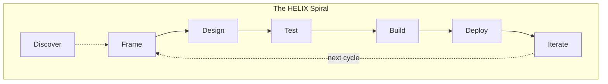

---
ddx:
  id: helix.workflow
---
# HELIX Workflow

HELIX is a methodology for steering AI-assisted software work through a
traceable artifact stack. It defines the document strand: intent, requirements,
design, tests, implementation evidence, deployment evidence, and iteration
learning. A runtime supplies the execution strand by reading those artifacts,
performing work, and recording results.

> **Quick Links**: [Quick Start Guide](QUICKSTART.md) | [Visual Overview](diagrams/workflow-overview.md) | [Reference Card](REFERENCE.md) | [Artifact Flow](diagrams/artifact-flow.md) | [Quality Ratchets](ratchets.md) | [DDx Methodology](DDX.md)

## Core Metaphor

The double helix of DNA has two strands wound around each other; neither leads,
neither follows. HELIX adopts that shape for software development. The
**document strand** holds intent, design, tests, and evidence. The **execution
strand** turns those into running code and observed outcomes. HELIX governs the
document strand and the alignment rules between strands; runtimes implement the
execution mechanics.

## Runtime Boundary

HELIX is not a tracker, queue runner, terminal wrapper, or hosting platform. It
is portable methodology plus artifact templates and alignment/planning guidance.
A runtime can integrate HELIX by providing work-item storage, execution loops,
agent invocation, review handoffs, and status reporting.

DDx is the current reference runtime and preserves the most complete operational
integration. Other runtimes can use HELIX without adopting DDx if they honor the
artifact authority hierarchy, activity gates, and alignment methodology
described here.

## Normative Methodology Contract

Treat the following files and directories as the canonical HELIX methodology
contract:

- [README.md](README.md) for the high-level model, artifact authority
  hierarchy, and runtime boundary
- [DDX.md](DDX.md) for historical methodology background and the DDx reference
  integration model
- `activities/*/artifacts/` for the canonical artifact-type catalog, prompts,
  templates, metadata, and examples
- [reconcile-alignment.md](actions/reconcile-alignment.md) for top-down
  reconciliation across the artifact stack
- [backfill-helix-docs.md](actions/backfill-helix-docs.md) for conservative
  reconstruction of missing documentation
- [alignment-review.md](templates/alignment-review.md) and
  [backfill-report.md](templates/backfill-report.md) for durable review outputs
- [metric-definition.yaml](templates/metric-definition.yaml) for shared metric
  definitions referenced by ratchets, experiments, and monitoring

Supporting action prompts, activity guides, diagrams, and examples are explanatory
unless this file explicitly names them as part of the normative contract. If a
supporting document conflicts with the authority hierarchy or artifact catalog,
follow the higher-authority document and update the stale support document.

## Artifact Loop

HELIX work moves through a repeatable artifact loop:

1. **Frame** the problem, users, principles, and requirements.
2. **Design** the system structure, decisions, solution slices, and technical
   contracts.
3. **Test** the intended behavior before implementation changes are accepted.
4. **Build** the smallest implementation slice that satisfies the tests and
   governing designs.
5. **Deploy** with rollout, monitoring, and recovery evidence.
6. **Iterate** by recording measurements, review findings, and follow-up work.

The optional **Discover** activity can precede Frame when the opportunity itself
needs validation before requirements are committed.

## Activities

0. **Discover** (optional) - Validate the opportunity before committing to Frame.
1. **Frame** - Define the problem, users, product requirements, principles, and
   acceptance boundaries.
2. **Design** - Choose architecture, record decisions, and describe bounded
   implementation slices.
3. **Test** - Write failing tests or equivalent executable checks that define
   system behavior.
4. **Build** - Implement code or documentation to satisfy the tests and designs.
5. **Deploy** - Release with rollout, monitoring, and recovery plans.
6. **Iterate** - Learn from measurements, reviews, incidents, and user feedback.

## Input Gates

Each activity after Frame has input gates that validate the previous activity's
outputs before allowing progression:

- **Design** cannot start until Frame outputs are coherent enough to govern it.
- **Test** cannot start until Design has enough authority to define behavior.
- **Build** cannot start until tests or equivalent acceptance checks define the
  expected result.
- **Deploy** cannot start until Build evidence satisfies the acceptance checks.
- **Iterate** begins once released behavior can be observed or reviewed.

This test-first approach keeps specifications ahead of implementation and makes
quality a design constraint rather than a cleanup activity.

## Authority Hierarchy

When HELIX artifacts disagree, resolve the conflict using this authority hierarchy:

1. **Product Vision** (`docs/helix/00-discover/product-vision.md`)
2. **Product Requirements** (`docs/helix/01-frame/prd.md`)
3. **Feature Specifications and User Stories** (`docs/helix/01-frame/features/`, `docs/helix/01-frame/user-stories/`)
4. **Architecture and ADRs** (`docs/helix/02-design/architecture.md`, `docs/helix/02-design/adr/`)
5. **Solution Designs and Technical Designs** (`docs/helix/02-design/solution-designs/`, `docs/helix/02-design/technical-designs/`)
6. **Test Plans and Executable Tests** (`docs/helix/03-test/`, `tests/`)
7. **Implementation Plans** (`docs/helix/04-build/implementation-plan.md`)
8. **Source Code and Build Artifacts** (`src/`, generated outputs)

`SD-XXX` solution designs are feature-level and describe the chosen approach for
a feature or cross-component capability. `TD-XXX` technical designs are
story-level and describe one bounded implementation slice that inherits from a
solution design.

## Conflict Resolution Rules

- Higher-order artifacts govern lower-order artifacts.
- Tests are executable specifications for the Build activity: code must satisfy
  tests, not the other way around.
- Tests do not override upstream requirements or design. If tests conflict with
  higher-order artifacts, return to the earlier activity and fix the inconsistency
  there.
- Source code is evidence of implementation, not the source of truth for
  requirements, design, or behavior.
- Runtime state can describe work progress, blockers, and evidence; it cannot
  redefine product intent, requirements, design, or test expectations by itself.

## Alignment Methodology

Alignment is the mechanism that keeps the artifact stack coherent. A HELIX
alignment pass reads from the highest relevant authority downward, classifies
mismatches, and records durable review evidence.

Use alignment when:

- product direction changes and downstream artifacts may now be stale
- implementation work exists but the governing artifact path is unclear
- generated documentation projects old behavior as current guidance
- runtime execution evidence disagrees with requirements, design, or tests
- the next safe planning or execution step is ambiguous

Alignment outcomes should classify each issue as one of these categories:

- **Aligned**: downstream artifacts and evidence match the governing authority
- **Incomplete**: required downstream artifacts or evidence are missing
- **Stale**: downstream artifacts describe an older but understandable plan
- **Divergent**: downstream artifacts authorize behavior that conflicts with the
  governing authority
- **Runtime-specific**: the content is valid only for one integration and should
  be scoped as such
- **Retired**: the artifact should no longer govern future work

## Skill Package Guidance

Portable HELIX skills should expose stable methodology capabilities rather than
being defined by any one runtime's command names. Skill names should describe the
capability they provide, keep their arguments runtime-neutral where practical,
and reference shared workflow resources by package-relative paths.

Published `SKILL.md` files must include `name` and `description`; include an
`argument-hint` when the skill accepts a trailing scope, selector, issue ID, or
goal. A skill package is incomplete if it includes the public skill entrypoints
without the shared workflow resources they depend on.

Portable HELIX skills do not need to mirror any CLI command surface. The
unified `/helix <mode>` skill is the operator-facing entry point; runtimes
own execution.

## Cross-Cutting Context

HELIX injects three layers of cross-cutting context into judgment-making work:

| Layer | Reference | Project File | Fallback |
|-------|-----------|-------------|----------|
| **Principles** | `references/principles-resolution.md` | `docs/helix/01-frame/principles.md` | `workflows/principles.md` defaults |
| **Concerns & Practices** | `references/concern-resolution.md` | `docs/helix/01-frame/concerns.md` | None |
| **Context Digest** | `references/context-digest.md` | Runtime-assembled work context | Fall back to upstream reads |

**Principles** are values that guide judgment, such as designing for simplicity,
writing tests first, or preserving local-first user experience.

**Concerns** are composable cross-cutting declarations from the workflow concern
library. They cover technology stacks, quality attributes, and conventions. Each
concern declares the areas it applies to and the practices that follow from that
declaration.

**Context digests** are compact summaries assembled for bounded work. They
include active principles, area-matched concerns, practices, relevant decisions,
and governing specification context so an executor rarely needs to rediscover
upstream context.

Concerns form a knowledge chain with other design artifacts:

- Spikes and POCs gather evidence about technology or approach questions.
- ADRs record decisions with rationale, citing spike evidence.
- Concerns index the decisions for context assembly, referencing ADRs.
- Context digests carry concern practices and ADR rationale into bounded work.

## Human-AI Collaboration

Throughout the workflow, responsibilities are shared.

Human responsibilities:

- Problem definition and creative vision
- Strategic decisions and architecture choices
- Code review and quality assessment
- User experience and business logic

AI agent responsibilities:

- Pattern recognition and suggestions
- Code generation and refactoring
- Test case generation
- Documentation and analysis

## Security Integration

HELIX integrates security practices throughout every activity, following DevSecOps
principles to ensure security is built in rather than bolted on.

Security-first approach:

- **Frame**: Security requirements, threat modeling, and compliance analysis are
  established upfront.
- **Design**: Security architecture and controls are designed into the system
  structure.
- **Test**: Security test suites are created alongside functional tests.
- **Build**: Secure coding practices and automated security scanning are
  integrated.
- **Deploy**: Security monitoring and incident response procedures are
  activated.
- **Iterate**: Security metrics are tracked and security posture continuously
  improves.

## Why HELIX?

Most software projects fail not because of technical challenges, but because of
unclear requirements, late quality checks, repeated rework, weak human-AI
handoffs, and security added after the fact.

HELIX addresses these problems through:

1. **Specification-first development**: requirements become executable checks.
2. **Built-in quality**: tests and acceptance evidence are defined before work is
   treated as complete.
3. **Clear gates**: later activities inherit authority from earlier activities instead
   of replacing it.
4. **Human-AI synergy**: collaboration boundaries are explicit.
5. **Security integration**: security is woven through every activity.

## When to Use HELIX

HELIX is ideal for:

- New products or features requiring high quality and clear specifications
- Mission-critical systems where defects are expensive
- Teams practicing TDD or moving toward specification-first development
- AI-assisted development projects needing durable context and traceability
- Security-sensitive applications requiring built-in security

HELIX may not be suitable for:

- Prototypes or POCs where speed matters more than traceability
- Simple scripts or tools with minimal complexity
- Emergency fixes requiring immediate deployment
- Teams unwilling to maintain governing artifacts

## Why Test-First?

The HELIX workflow favors tests or equivalent executable acceptance checks before
implementation because:

1. **Tests are the specification**: they define what the system should do.
2. **Definition of done is concrete**: implementation is complete when checks
   pass and governing artifacts agree.
3. **Over-engineering is constrained**: build only what the tests and designs
   require.
4. **Quality is immediate**: defects are caught near the change.
5. **Refactoring is safer**: green checks provide confidence to improve code.

## The TDD Cycle

Within the Test and Build activities, HELIX follows the Red-Green-Refactor cycle:

1. **Red**: write a failing test or acceptance check that defines desired
   behavior.
2. **Green**: write minimal implementation to make the check pass.
3. **Refactor**: improve quality while keeping checks green.

## Getting Started

To use HELIX in any runtime:

1. Start with the artifact catalog under `activities/*/artifacts/` in the HELIX
   content package.
2. Create or update the highest-authority artifact that governs the work.
3. Move downward through the activity gates until a bounded implementation slice is
   authorized.
4. Have your runtime execute that slice and record evidence.
5. Run alignment when artifacts, runtime state, or public documentation appear to
   disagree.

For a runtime-specific operator path — the concrete commands that queue,
execute, and report on work — use the install guide for your integration
under [`docs/install/`](../docs/install/). The DDx reference-runtime
commands live in [`docs/install/ddx.md`](../docs/install/ddx.md).

## Resources and Support

- [Quick Start Guide](QUICKSTART.md): getting started with HELIX concepts
- [Visual Diagrams](diagrams/): workflow and artifact visualizations
- [Reference Card](REFERENCE.md): quick lookup for actions and concepts
- [Activity Guides](activities/): deep dive into each activity
- [Artifact Prompt Roots](REFERENCE.md): canonical prompt and template
  directories by activity

## Runtime Operator Appendix

HELIX itself ships no commands. Each runtime supplies the operator path that
queues, executes, and reports on work — and provides the work-item store,
execution loop, and status reporting. The methodology requirement is only
that work be governed (work-item-first), measured against acceptance criteria,
and reported back so follow-on work re-enters planning; *how* a runtime
realizes that is its own concern.

For the concrete commands of a specific integration, see its install guide
under [`docs/install/`](../docs/install/):

- [`docs/install/ddx.md`](../docs/install/ddx.md) — DDx reference runtime
  (work-item tracker, execution loop, queue guard, model routing).
- [`docs/install/claude-code.md`](../docs/install/claude-code.md),
  [`docs/install/codex.md`](../docs/install/codex.md),
  [`docs/install/copilot.md`](../docs/install/copilot.md),
  [`docs/install/databricks-genie.md`](../docs/install/databricks-genie.md)
  — the other supported runtimes.

A runtime that provides a work-item store should govern items by the HELIX
authority stack, have them cite the canonical artifacts that authorize the
work, and treat that store as the steering surface for decomposition,
blockers, supersession, and follow-up work rather than out-of-band task
lists. Closing a work item records completion; it does not redefine
requirements, design, or tests — if execution changes behavior or scope,
update the governing canonical artifacts explicitly.

---

HELIX starts with artifacts and alignment. Runtime integrations decide how work
is queued, executed, and reported.
