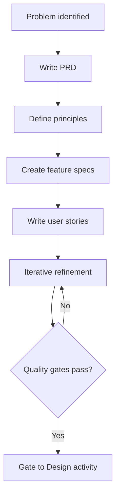

# Activity 01: Frame

The foundation activity where we define WHAT to build and WHY before considering HOW.

## Purpose

The Frame activity establishes the project's foundation by understanding the
problem, defining business value, and aligning stakeholders on objectives.
Technical solutions are intentionally deferred to the Design activity.

**Key Principle**: Problem First, Solution Later.

## Input Gates

Prerequisites to enter this activity (defined in `GATE.yaml`):
- **Problem or opportunity identified**: A clear business need or challenge
- **Time allocated for analysis**: Dedicated time for thorough framing

## Exit Gates

Criteria to proceed to Design activity (defined in `GATE.yaml`):
- **PRD approved**: Problem quantified, P0s testable, metrics measurable, non-goals specific, personas validatable
- **P0 requirements specified**: Critical features have detailed, testable specifications
- **Success metrics measurable**: Metrics have numeric targets and named measurement methods
- **Feature specs complete**: Each feature links to PRD requirements, has testable functional and non-functional requirements
- **User stories written**: Each story traces a complete vertical slice with concrete test scenarios
- **Principles established**: Design principles documented
- **Risks assessed**: Major risks identified with concrete mitigation strategies

## Core Artifacts

The Frame activity produces four core artifacts. Each artifact directory under
`artifacts/` includes `template.md` (structure), `prompt.md` (section-by-section
guidance and quality checklist), and `meta.yml` (validation rules and
type-level dependencies; see ADR-004).

### 1. Product Requirements Document (PRD)

**Artifact**: `artifacts/prd/`
**Output**: `docs/helix/01-frame/prd.md`

The authority document for what to build and why:
- Summary (standalone 1-pager)
- Problem statement with quantified pain
- Success metrics with numeric targets and measurement methods
- Prioritized requirements (P0/P1/P2)
- Acceptance test sketches for every P0
- Technical context (stack decisions — rationale in ADRs)
- Risks with concrete mitigations
- Open questions (replaces scattered TBD markers)

### 2. Feature Specifications

**Artifact**: `artifacts/feature-specification/`
**Output**: `docs/helix/01-frame/features/FEAT-NNN-<name>.md`

Per-feature requirements and scope:
- Functional requirements (testable, numbered for traceability)
- Non-functional requirements with numeric targets
- User stories referenced by ID (not duplicated)
- Feature-specific success metrics
- Edge cases and error handling
- Dependencies and out of scope

### 3. User Stories

**Artifact**: `artifacts/user-stories/`
**Output**: `docs/helix/01-frame/user-stories/US-NNN-<slug>.md`

One file per story. Stable design artifacts referenced by tracker issues
across design, implementation, and testing:
- Story statement (specific persona, user action, measurable outcome)
- Context (why this matters — 2-4 sentences)
- Walkthrough (step-by-step vertical slice)
- Acceptance criteria (Given/When/Then, independently testable)
- Edge cases with expected behavior
- Test scenarios with concrete input/output values
- Dependencies and out of scope

### 4. Principles

**Artifact**: `artifacts/principles/`
**Output**: `docs/helix/01-frame/principles.md`

Cross-cutting design principles that guide judgment calls:
- Project-specific principles layered on HELIX defaults
- Applied when choosing between two valid options
- Not workflow rules or process enforcement

## Optional Artifacts

Use when the situation demands them:

- **Research Plan** (`artifacts/research-plan/`): When the problem domain is
  genuinely unknown and requires investigation before framing
- **Feasibility Study** (`artifacts/feasibility-study/`): When viability is
  uncertain across technical, business, or resource dimensions

## Process Flow

## Human vs AI Responsibilities

**Human**: Vision, priorities, stakeholder alignment, success metrics, final approval.

**AI**: Documentation structure, consistency checking, gap analysis, template
application, quality checklist verification.

## Using AI Assistance

Start with the relevant `prompt.md` in each artifact directory — it contains
section-by-section guidance and a quality checklist with blocking/warning
checks. Read both `template.md` and `prompt.md` before drafting.

Common entry points:
- `artifacts/prd/`
- `artifacts/feature-specification/`
- `artifacts/user-stories/`
- `artifacts/principles/`
