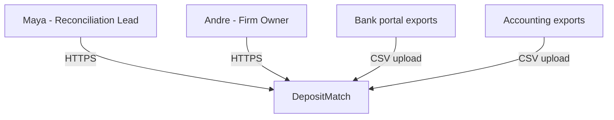
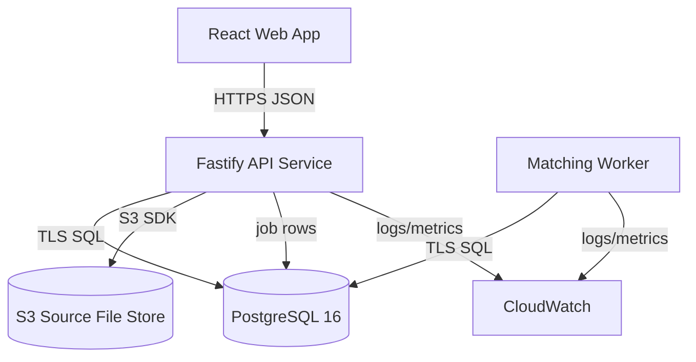
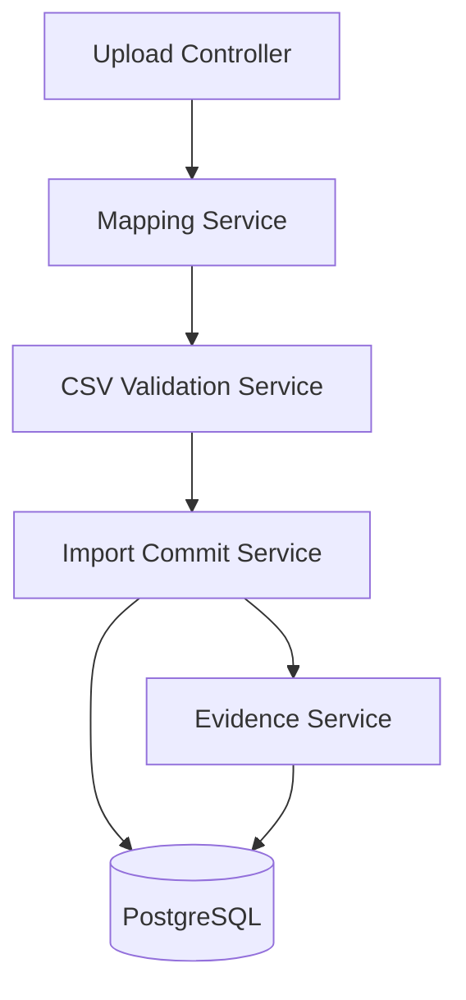
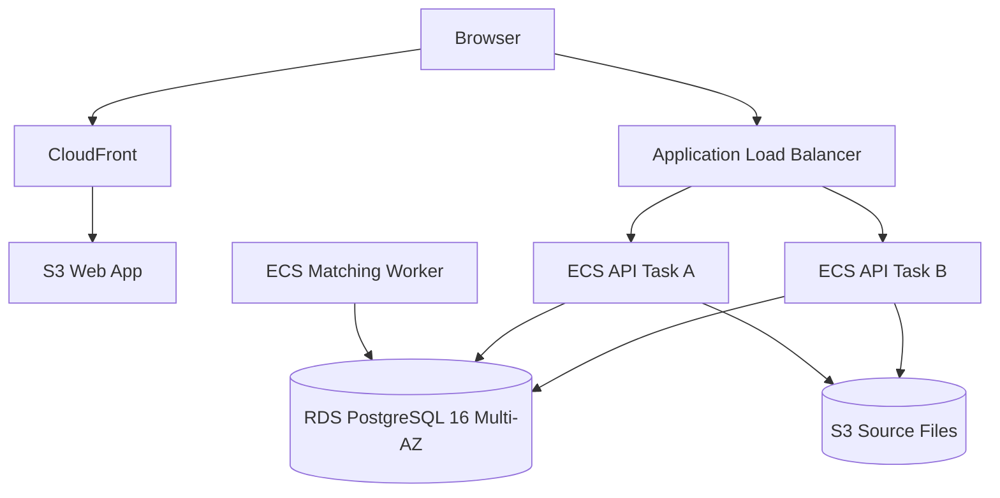
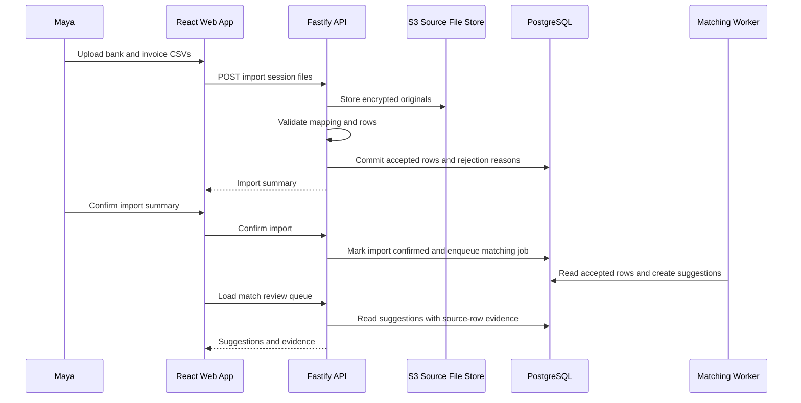

---
ddx:
  id: example.architecture.depositmatch
  depends_on:
    - example.product-vision.depositmatch
    - example.prd.depositmatch
    - example.concerns.depositmatch
    - example.feature-specification.depositmatch.csv-import
  review:
    self_hash: 64b7297158175ff16812e401fe093f7624b5ba70b11265a7a4bdf324e50a6bff
    deps:
      example.concerns.depositmatch: 34738dd02d95489bcc3c00b5be15b630ae9fb15ab4f99f45d0ec1ecd1d3f1c6e
      example.feature-specification.depositmatch.csv-import: d85530eb091209cf9989c9cac3bc1f1063358a5b79964ca0e5e7a384fa77c44a
      example.prd.depositmatch: c9c24e1694af4548a6deaad8d92059e365da110148bd9adc44d8640dff9770a4
      example.product-vision.depositmatch: 8abbb2fcb552b536f07829f57d91ef3ae8dbf52a6066955222e83d196b59b5ae
    reviewed_at: "2026-05-15T04:11:24Z"
---

# Architecture

## Scope

This architecture covers DepositMatch v1: CSV import, match suggestion review,
exception handling, audit evidence, and reconciliation exports for small
bookkeeping firms. It is driven by the PRD goals of reducing weekly
reconciliation time, preserving reviewer trust, and keeping unresolved deposits
owned. Bank feeds, accounting platform sync, payroll, inventory, and tax
workflows are outside the v1 architecture boundary.

## Level 1: System Context

| Element | Type | Purpose | Protocol |
|---------|------|---------|----------|
| Maya, Reconciliation Lead | User | Imports exports, reviews suggestions, resolves exceptions | HTTPS browser |
| Andre, Firm Owner | User | Reviews firm-level reconciliation reports | HTTPS browser |
| DepositMatch | System | Reconciliation workspace and evidence store | HTTPS |
| Bank portal exports | External source | Provides deposit CSV files | Manual CSV export/upload |
| Accounting exports | External source | Provides invoice CSV files | Manual CSV export/upload |

## Level 2: Container Diagram

| Container | Technology | Responsibilities | Communication |
|-----------|------------|------------------|---------------|
| Web App | React 18, TypeScript 5 | Import workflow, mapping review, match review, exception queue, reports | HTTPS JSON to API |
| API Service | Node 20, Fastify 5, TypeScript 5 | Auth boundary, CSV upload orchestration, validation, matching commands, exception commands, exports | HTTPS JSON; SQL to PostgreSQL; S3 SDK |
| Matching Worker | Node 20, TypeScript 5 | Asynchronous match suggestion generation and confidence scoring | PostgreSQL job table; SQL |
| Database | PostgreSQL 16 on Amazon RDS | Clients, imports, source rows, invoices, deposits, matches, exceptions, audit log | TLS SQL |
| Source File Store | Amazon S3 with SSE-KMS | Encrypted uploaded CSV originals for audit and reprocessing | S3 API from API Service |
| Observability | CloudWatch Logs and Metrics | Application logs, import timing, worker failures, backup alarms | AWS agent/API |

## Level 3: Component Diagram

The API Service needs component detail because CSV import, traceability, and
matching are coupled at the boundary.

| Component | Container | Purpose | Notes |
|-----------|-----------|---------|-------|
| Upload Controller | API Service | Receives bank and invoice CSV uploads for one client import session | Rejects non-CSV files before parsing |
| Mapping Service | API Service | Saves and applies per-client column mappings | Never imports rows with unresolved required mappings |
| CSV Validation Service | API Service | Validates amounts, dates, identifiers, duplicates, and required columns | Produces row-level rejection reasons |
| Import Commit Service | API Service | Atomically records accepted source rows and traceability fields | Transaction boundary for import confirmation |
| Evidence Service | API Service | Supplies source-row evidence to match review, exceptions, and exports | Reads normalized fields and source metadata |

## Deployment

| Component | Infrastructure | Instances | Scaling | Backup / Recovery |
|-----------|----------------|-----------|---------|-------------------|
| Web App | S3 static hosting behind CloudFront, us-east-1 | 1 distribution | CDN-managed | Versioned S3 bucket; redeploy from CI |
| API Service | ECS Fargate service behind Application Load Balancer, us-east-1 | 2 tasks minimum | CPU > 60% for 5 minutes or p95 import latency > 3 seconds | Rolling deploy; previous task definition retained |
| Matching Worker | ECS Fargate service, us-east-1 | 1 task minimum | Job backlog > 100 for 5 minutes | Restart failed task; jobs remain in PostgreSQL |
| Database | Amazon RDS PostgreSQL 16, Multi-AZ | 1 primary, 1 standby | Vertical scaling by planned maintenance | PITR enabled; 15-minute RPO; 4-hour RTO |
| Source File Store | S3 bucket with SSE-KMS and versioning | Regional service | S3-managed | Versioning and lifecycle retention |

## Data Flow

## Quality Attributes

| Attribute | Target | Strategy | Verification |
|-----------|--------|----------|--------------|
| Import performance | Validate and summarize 10,000 total rows in under 5 seconds | Stream parse uploads, validate before commit, keep import commit transactional | Import benchmark in CI with representative CSV fixtures |
| Evidence traceability | 100% of accepted rows used in suggestions expose source file, row number, identifier, amount, and date | Preserve source metadata at import commit and read it through Evidence Service | Story tests for match review evidence and reconciliation export |
| Security | No raw financial row values in analytics or application logs | Structured logging allowlist; encrypted S3 and RDS storage; role-scoped audit access | Log scan tests, infrastructure review, access-control tests |
| Availability | 99.5% monthly availability for pilot firms | Two API tasks, RDS Multi-AZ, static web CDN, worker jobs persisted in DB | CloudWatch uptime and error-rate alarms |
| Disaster Recovery | 15-minute RPO and 4-hour RTO | RDS point-in-time recovery, S3 versioning, retained task definitions | Quarterly restore drill before paid launch |

## Decisions and Tradeoffs

| Decision | Status | Rationale | Follow-up |
|----------|--------|-----------|-----------|
| Use PostgreSQL 16 as the system of record | Accepted inline | Import traceability, matching evidence, exceptions, and audit logs need transactional consistency more than separate specialized stores. | Create ADR before production if another store is introduced. |
| Store uploaded CSV originals in encrypted S3 | Accepted inline | Preserving originals supports audit and reprocessing without bloating PostgreSQL. | Define retention period with firm owners and legal reviewer. |
| Use PostgreSQL-backed worker jobs for v1 | Accepted inline | Pilot volume does not justify a separate queue yet; keeping jobs in PostgreSQL reduces operational surface. | Revisit if matching backlog exceeds 100 jobs for 5 minutes repeatedly. |
| Keep bank feeds and accounting APIs outside v1 | Accepted by PRD non-goals | CSV import is enough to validate reviewer trust and weekly reconciliation speed. | Revisit after pilot CSV success metrics are met. |
