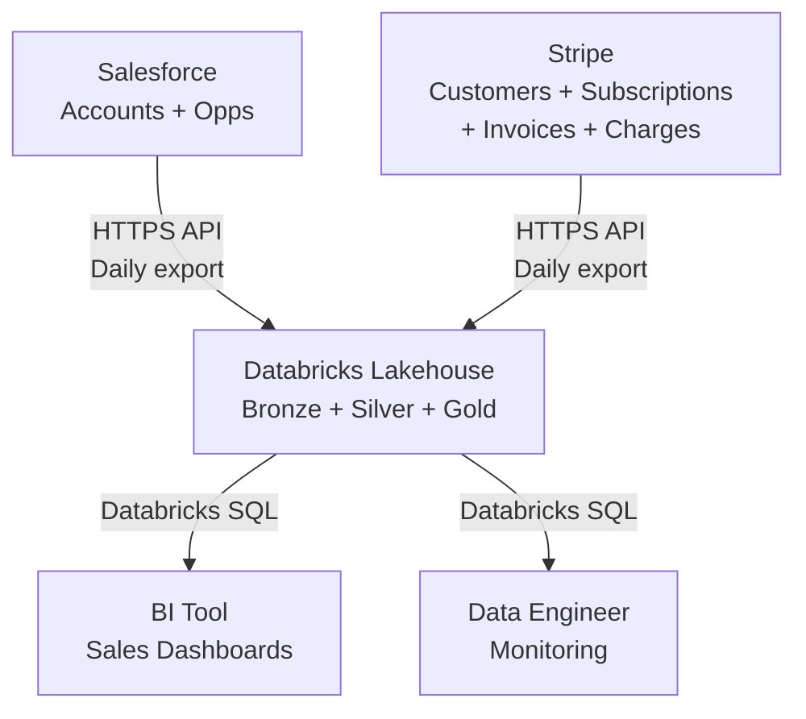

---
ddx:
  id: example.data-architecture.customer-360
  # Previous depends_on: example.data-prd.customer-360 — dropped when
  # data-prd collapsed into prd as kind: data variant (ADR-008). No
  # equivalent example.prd.customer-360 is yet published.
---

# Data Architecture: Customer-360 Analytics

## Scope

This architecture covers the Customer-360 medallion pipeline: daily batch ingestion
of Salesforce accounts, opportunities, and Stripe customers, subscriptions, invoices,
and charges into a Databricks Lakehouse. It includes Bronze raw-layer storage,
Silver reconciliation and deduplication, and Gold fact/dimension tables for
analytics queries. Historical loads of 12 months are supported; incremental daily
loads begin in week 2. Streaming ingestion, ML training stores, and external data
warehouse federation are outside v1 scope.

## Level 1: System Context

| Element | Type | Purpose | Protocol |
|---------|------|---------|----------|
| Salesforce | External source | Customer accounts, opportunities, ownership | HTTPS REST API; daily full export |
| Stripe | External source | Customers, subscriptions, invoices, charges | HTTPS REST API; daily full export (webhook in v2) |
| Databricks Lakehouse | Data Platform | Medallion storage and compute for ingestion and queries | Databricks SQL; PySpark jobs |
| BI Tool (Tableau/Sigma) | Consumer | Sales and finance dashboards querying Gold tables | Databricks SQL via ODBC |
| Data Engineer | Role | Orchestrates jobs, monitors SLAs, maintains schemas | Databricks workflows, notebooks |



## Level 2: Medallion Architecture

### Bronze Layer (Raw)

Immutable copies of source system exports, organized by system and entity.

| Table | Source | Partitioning | Retention | Notes |
|-------|--------|--------------|-----------|-------|
| bronze.salesforce_accounts | Salesforce API | date_loaded | 90 days | Full daily export; preserves all fields |
| bronze.salesforce_opportunities | Salesforce API | date_loaded | 90 days | Full daily export; includes closed_date |
| bronze.stripe_customers | Stripe API | date_loaded | 90 days | Full daily export; includes metadata tags |
| bronze.stripe_subscriptions | Stripe API | date_loaded | 90 days | Full daily export; includes status changes |
| bronze.stripe_invoices | Stripe API | date_loaded | 90 days | Full daily export; raw line items |
| bronze.stripe_charges | Stripe API | date_loaded | 90 days | Full daily export; includes payment outcomes |

**Quality**: No transformation; SLA violations block Silver load until Bronze is complete.

### Silver Layer (Deduplicated & Reconciled)

Cleaned, deduplicated, and reconciled data with lineage and quality flags.

| Table | Source(s) | Partitioning | Retention | Key Transformations |
|-------|-----------|--------------|-----------|---------------------|
| silver.dim_customer | bronze.salesforce_accounts + bronze.stripe_customers | customer_id | 3 years | 1:1 Salesforce-to-Stripe match via email; hash PII; null-check on account names |
| silver.dim_date | N/A (calendar) | date_key | 5 years | Standard calendar table; fiscal month, quarter, year |
| silver.fct_subscription_event | bronze.stripe_subscriptions | subscription_id, event_date | 3 years | Deduplicate on Stripe subscription ID; flag late-arriving rows; join to dim_customer |
| silver.fct_payment_transaction | bronze.stripe_charges + bronze.stripe_invoices | charge_id, payment_date | 3 years | Flatten invoice line items; join charge to invoice and subscription; hash card brand |
| silver.reconciliation_log | N/A | load_date | 90 days | Count of matched/unmatched pairs per load; reconciliation confidence scores |

**Quality**: PII hashing, null validation, late-arriving fact flags, join lineage recorded.

### Gold Layer (Aggregated Facts)

Business-ready tables for analytics and reporting.

| Table | Business Use | Grain | Partitioning | Retention |
|-------|------------------|-------|--------------|-----------|
| gold.fct_monthly_revenue | Sales forecasting, revenue metrics | 1 row per customer per month | customer_id, year_month | 3 years |
| gold.fct_subscription_health | Churn risk scoring, subscription metrics | 1 row per subscription | subscription_id, as_of_date | 3 years |
| gold.dim_customer_account | Account overview, drill-down | 1 row per customer | customer_id | 3 years |

**Computations**:
- `fct_monthly_revenue`: Sums paid invoices grouped by customer and calendar month; includes subscription state
- `fct_subscription_health`: Latest subscription status, months active, failed payment count, aging of unpaid invoices
- `dim_customer_account`: Joins Salesforce account attributes with current Stripe subscription status

## Level 3: Data Flow

```mermaid
sequenceDiagram
    participant SF as Salesforce API
    participant Stripe as Stripe API
    participant DBX as Databricks
    participant Bronze as Bronze Tables
    participant Silver as Silver Tables
    participant Gold as Gold Tables
    participant BI as BI Tool

    SF->>DBX: Daily export (accounts, opps)
    Stripe->>DBX: Daily export (customers, subs, invoices, charges)
    DBX->>Bronze: Land raw data; validate schema and completeness
    Note over DBX: Reconciliation: match Salesforce-Stripe via email
    Bronze->>Silver: Deduplicate, hash PII, join and flag late arrivals
    Note over Silver: Check reconciliation accuracy (98% threshold)
    Silver->>Gold: Aggregate facts and dimensions
    Gold->>BI: SQL query for dashboards
    Note over BI: Sales forecast, churn alerts, AR aging
```

## Level 4: Deployment and Compute

### Orchestration

| Component | Technology | Schedule | Resource | SLA |
|-----------|----------|----------|----------|-----|
| Salesforce Export Job | Databricks Workflow + PySpark | 10pm UTC daily | 2-worker job cluster, 8 DBU | Complete by 2am UTC |
| Stripe Export Job | Databricks Workflow + PySpark | 10pm UTC daily | 2-worker job cluster, 8 DBU | Complete by 2am UTC |
| Reconciliation + Silver Load | Databricks Workflow + SQL | 3am UTC daily (after Bronze) | 2-worker job cluster, 8 DBU | Complete by 5am UTC |
| Gold Aggregation + Refresh | Databricks Workflow + SQL | 5am UTC daily (after Silver) | 2-worker job cluster, 8 DBU | Complete by 7am UTC |

### Compute Sizing

- **Job Cluster**: 2 workers, 8 DBU/hour per cluster
- **Estimated Monthly Cost**: 4 jobs × 8 DBU × 30 days = 960 DBU ≈ $480 USD
- **Query Workload**: +50 DBU/month for analyst ad-hoc queries (estimate)
- **Total Budget**: ≤ $500 USD/month

### Storage

| Layer | Format | Location | Retention Policy |
|-------|--------|----------|------------------|
| Bronze | Delta | s3://main-catalog/customer_360_bronze/ | Delete after 90 days |
| Silver | Delta | s3://main-catalog/customer_360_silver/ | Delete after 3 years (Delta VACUUM) |
| Gold | Delta | s3://main-catalog/customer_360_gold/ | Delete after 3 years (Delta VACUUM) |

## Quality Attributes

| Attribute | Target | Strategy | Verification |
|-----------|--------|----------|--------------|
| Data Freshness | Gold tables available by 7am UTC daily | Orchestrated daily batch completing 5am; monitor job logs for failures | Scheduled report execution; query execution logs |
| Reconciliation Accuracy | ≥ 98% Salesforce-Stripe matched pairs | Fuzzy email matching in Silver; confidence scoring on match quality | Daily reconciliation_log audit; manual spot-check |
| Lineage Traceability | 100% of Gold rows trace to Bronze source records | Preserve source IDs and load timestamps through all layers | Audit queries joining Gold → Silver → Bronze |
| Cost Containment | ≤ $500 USD/month | Monitor job runtime and query execution time; set alarms on DBU overage | Monthly billing dashboard in Databricks |

## Key Design Decisions

| Decision | Rationale | Tradeoffs |
|----------|-----------|-----------|
| Daily batch, not streaming | Stripe webhook integration costs 2+ weeks; batch fully validates; sales SLA accepts 24-hour latency | Query latency ≤ 24 hours; no real-time churn alerts; easier to replay failed days |
| Separate Bronze/Silver/Silver schemas | Data governance: PII isolation, access control per layer, easy to backfill one layer without reprocessing others | More tables to maintain and document; requires clear naming conventions |
| Salesforce-Stripe match via email + fuzzy | Email is the most reliable cross-system identifier; fuzzy matching handles case and domain normalization | ≠ 100% accuracy; requires manual linking for edge cases; depends on email data quality |
| Flatten Stripe invoice line items in Silver | Simplifies Gold aggregations; avoids multi-row-per-invoice complexity in joins | Denormalizes at Silver (but Silver is allowed to denormalize for analytics) |
| Hash card brand (not full card) in Silver | PCI compliance: no raw card tokens or full numbers stored | Aggregate metrics cannot distinguish card issuer; acceptable for v1 |

## Future Considerations

- **Streaming Subscriptions**: Stripe webhooks in v2 for sub-minute payment latency
- **ML Feature Store**: Separate feature-engineering layer for churn-scoring models
- **Cross-System Orchestration**: Airflow/dbt Cloud for multi-workspace lineage
- **Snowflake Federation**: External tables for cost optimization if query volume scales
