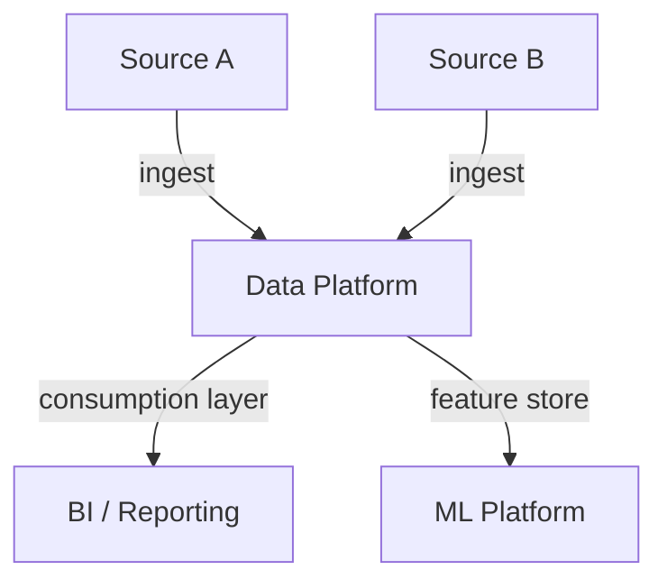
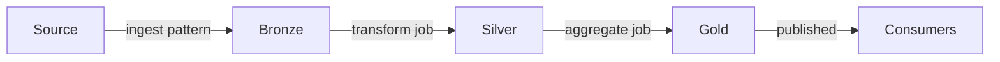

---
ddx:
  id: data-architecture
---

# Data Architecture

Platform- and pipeline-level shape of the data product: medallion topology,
processing-framework choices, governance model, and pipeline-level quality
contracts. Entity-level modelling (logical schema, access patterns,
constraints, migration) lives in [[data-design]].

## Overview

[Describe the data product being architected, the business problem it solves,
and the system context. Name the key data flows and platform fit. Reference
[[prd]] (kind: data) for the requirements and success metrics this architecture must
satisfy.]

### Scope

[What data flows and systems are covered. What is deliberately out of bounds.
Which requirements from [[prd]] (kind: data) drive the design decisions.]

### System Context

| External System | Role | Protocol | Data Volume |
|-----------------|------|----------|------------|
| [Source system] | [Role in the pipeline] | [API, batch export, CDC] | [Order-of-magnitude per period] |
| [Consumer system] | [How it consumes Gold] | [Delta share, SQL, API] | [Query volume] |



## Medallion Topology

### Layer Strategy

[State the medallion strategy: Bronze (raw), Silver (validated), Gold
(consumption). For each layer, name the transformation scope, quality gates,
and consumer responsibilities. Justify the choice against [[prd]] (kind: data)
freshness and quality requirements.]

### Bronze Layer (Raw Ingestion)

- **Purpose**: Land source data in its native form without transformation.
- **Source integration pattern**: [Auto Loader, Streaming Tables, scheduled
  batch import, CDC]
- **Schema handling**: [Strict / inferred / evolution policy]
- **Retention policy**: [Rationale tied to cost and replay needs]

Responsibilities:
- Ingest all records from source.
- Preserve source schema exactly (no renames or coercion).
- Tag records with ingest timestamp and source-system identifier.
- Quarantine records that fail schema validation.

Quality gates: ingest-metadata presence, no column truncation, source
availability watchdog.

### Silver Layer (Validated and Transformed)

- **Purpose**: Cleansed, deduplicated, business-logic-ready data.
- **Deduplication strategy**: [Key + ordering rule]
- **Type coercion / null policy**: [Defaults vs reject]
- **Referential integrity**: [Which FK relationships are enforced and how]

Join strategy (pipeline-level — entity-level joins live in [[data-design]]):

| Join | Source Layers | Type | Cardinality | Latency Impact |
|------|---------------|------|-------------|----------------|
| [Logical join name] | [Left / Right] | [Inner / Outer] | [1:1 / 1:N] | [Qualitative] |

Quality gates: PK uniqueness, NOT NULL on critical columns, row-count
reconciliation with Bronze within tolerance.

### Gold Layer (Consumption)

- **Purpose**: Business-ready tables optimised for consumer queries.
- **Optimisation strategy**: [Partitioning, clustering / z-order, materialised
  views — at the pipeline level, not column-level]
- **Retention policy**: [Compliance and analytics horizon]

Consumption tables (entity definitions live in [[data-design]]):

| Table | Use Case | Consumers | Freshness Target |
|-------|----------|-----------|------------------|
| [Gold table name] | [Use case from PRD (kind: data)] | [Persona] | [Target tied to SLA] |

Quality gates: aggregate reconciliation with Silver, referential integrity
across Gold, latency within consumer SLA.

## Data Flow

[Describe how data moves through the medallion layers. Clarify ingestion
frequency, transformation latency, and refresh strategy.]



### Incremental vs Full Refresh

- **Bronze**: [CDC / append / full reload — rationale]
- **Silver**: [Incremental keys / full recalc — rationale]
- **Gold**: [Append-only / snapshot / merge — rationale]

## Processing Semantics

### Streaming vs Batch Decision

| Layer | Strategy | Rationale | SLA Implication |
|-------|----------|-----------|-----------------|
| Bronze | [Streaming / Batch / Incremental] | [Why] | [Freshness achieved] |
| Silver | [Streaming / Batch / Incremental] | [Why] | [Freshness achieved] |
| Gold | [Streaming / Batch / Incremental] | [Why] | [Freshness achieved] |

### Processing Framework

- **Framework**: [Databricks SQL, PySpark, dbt, Streaming Tables, Flink, …]
- **Orchestration**: [Workflows, Airflow, dbt Cloud, Dagster, …]
- **Failure handling**: [Retry policy, dead-letter queue, manual intervention]
- **Idempotence / exactly-once posture**: [Per layer]
- **Schema evolution policy**: [Auto-add / manual approval / strict]

### Latency and Throughput Targets

| Stage | Latency Target | Throughput Target | Binding Constraint |
|-------|----------------|-------------------|--------------------|
| Source → Bronze | [From PRD (kind: data) SLA] | [Order of magnitude] | [Rate limit, API quota] |
| Bronze → Silver | [From PRD (kind: data) SLA] | [Order of magnitude] | [Compute / dedup cost] |
| Silver → Gold | [From PRD (kind: data) SLA] | [Order of magnitude] | [Query complexity] |

## Pipeline-Level Quality Contracts

[Express the contracts the *pipeline* enforces at each layer boundary.
Column-level field rules belong in [[data-quality-expectations]]; this
section names which contracts the architecture commits to enforce and
where.]

### Bronze → Silver

- **Schema contract**: [What Silver requires of Bronze]
- **Volume contract**: [Acceptable row-count delta]
- **Freshness contract**: [Max ingest lag before Silver is held]
- **Violation handling**: [Alert / hold / quarantine]

### Silver → Gold

- **Uniqueness contract**: [Which keys are unique at Gold]
- **Referential contract**: [Which FK relationships are guaranteed]
- **Aggregate-reconciliation contract**: [Sums and counts must agree within
  tolerance]
- **Violation handling**: [Reject / rollback / alert]

### Cross-Layer Contracts

| Contract | Assertion | If Violated |
|----------|-----------|-------------|
| [Row count Bronze → Silver] | [Within tolerance] | [Alert + manual audit] |
| [Cardinality Silver → Gold] | [Stable across refresh] | [Reject until reconciled] |
| [FK integrity across Gold] | [No orphans] | [Quarantine + alert] |

Detailed `EXPECT` clauses, field-level constraints, and freshness predicates
live in [[data-quality-expectations]].

## Governance and Access Control

### Identity and Access Model

| Role | Catalog Scope | Layer Access | Permissions |
|------|---------------|--------------|-------------|
| [Role from PRD (kind: data) consumers] | [Catalog / schema] | [Bronze / Silver / Gold] | [SELECT / MODIFY / EXECUTE] |

### Data Classification and Retention

| Layer | Classification | Sensitive Categories | Retention Policy | Masking Policy |
|-------|----------------|----------------------|------------------|----------------|
| Bronze | [Class] | [Categories — not specific columns; those live in data-design] | [Policy tied to compliance] | [Who sees raw] |
| Silver | [Class] | [Categories] | [Policy] | [Who sees masked vs raw] |
| Gold | [Class] | [Categories] | [Policy] | [Default masking for BI] |

### Fine-Grained Access Control

- **Row-level security**: [Tenant / region predicate — policy, not the
  predicate code, which lives in [[data-design]]]
- **Column-level security**: [Which classifications are masked for which
  roles]
- **Dynamic views**: [Masking-function strategy]

## Platform Design

### Catalog Organisation

```
[catalog]
├── [schema]
│   ├── [bronze table family]
│   ├── [silver table family]
│   └── [gold table family]
├── metadata
│   ├── pipeline_runs
│   └── quality_metrics
```

### Compute Strategy

| Workload | Compute Tier | Sizing Approach | Rationale |
|----------|--------------|-----------------|-----------|
| Bronze ingestion | [Tier] | [Auto-scale bounds / fixed] | [Continuous vs scheduled] |
| Silver transformation | [Tier] | [Sizing approach] | [Batch vs streaming] |
| Gold consumption | [Tier] | [Sizing approach] | [Query pattern] |

Cost-shaping levers (qualitative — concrete numbers belong in operational
runbooks, not the architecture):

- Spot / preemptible instances for retryable workloads.
- Auto-termination of idle clusters.
- Partition pruning and clustering for scan reduction.
- Materialised vs on-demand aggregates.

### Storage Strategy

| Layer | Format | Partitioning | Clustering / Optimisation |
|-------|--------|--------------|---------------------------|
| Bronze | [Delta / Iceberg / …] | [By date / source] | [Compaction policy] |
| Silver | [Format] | [By key / date] | [Z-order / cluster keys] |
| Gold | [Format] | [By query predicate] | [Materialised views / cache] |

### Platform Features in Use

| Feature | Use Case | Configuration Note |
|---------|----------|--------------------|
| [Auto Loader / equivalent] | [Bronze ingestion] | [Trigger mode, schema mode] |
| [Streaming Tables / equivalent] | [Bronze → Silver] | [Trigger / latency target] |
| [Pipeline orchestrator] | [End-to-end refresh] | [Schedule / dependency] |
| [Governance catalog] | [Access + lineage] | [Cross-team sharing posture] |

For non-Databricks platforms, see
[`docs/resources/databricks-platform-substitution.md`](../../../../../docs/resources/databricks-platform-substitution.md)
for the platform-equivalent terms.

## Decisions and Tradeoffs

### Key Architecture Decisions

| Decision | Choice | Rationale | Alternative Considered | Consequence |
|----------|--------|-----------|------------------------|-------------|
| [Medallion layering] | [Choice] | [Why] | [Alternative] | [Tradeoff] |
| [Streaming vs batch per layer] | [Choice] | [Why] | [Alternative] | [Tradeoff] |
| [Compute tier per workload] | [Choice] | [Why] | [Alternative] | [Tradeoff] |

### Performance vs Cost Tradeoffs

- [Real-time vs near-real-time ingestion — freshness gain vs sustained
  compute cost]
- [Materialised vs on-demand Gold aggregates — query latency vs storage]
- [Spot vs on-demand compute — cost savings vs interruption risk]

### Known Risks and Mitigations

| Risk | Mitigation |
|------|------------|
| [Source rate limit causes backlog] | [Backoff + queue buffering + lag alert] |
| [PII exposure in Bronze] | [Masked views + audit logs] |
| [Schema drift from source] | [Schema registry + manual approval gate] |

---

## Review Checklist

- [ ] **Scope** clearly states which data flows are in / out of bounds.
- [ ] **Medallion topology** names Bronze / Silver / Gold purposes and
  transformation rules.
- [ ] **Data flow diagrams** show how data moves through layers and to
  consumers.
- [ ] **Processing semantics** explicitly state streaming vs batch per layer
  with latency targets tied to [[prd]] (kind: data).
- [ ] **Pipeline-level quality contracts** name which contracts each layer
  boundary enforces; detailed `EXPECT` clauses are deferred to
  [[data-quality-expectations]].
- [ ] **Failure handling** specifies what happens when a contract fails
  (alert, reject, quarantine, rollback).
- [ ] **Access control** model covers identity, row-level, column-level,
  and sensitive-data masking at the policy level.
- [ ] **Platform design** names catalog organisation, compute tiering, and
  storage strategy without committing to hardcoded cost numbers.
- [ ] **Decisions and tradeoffs** document key choices with rationale and
  alternatives considered.
- [ ] **Cross-layer contracts** are defined (reconciliation, cardinality,
  no orphans).
- [ ] **SLA per layer** is documented (freshness, latency, availability)
  and traces to [[prd]] (kind: data).
- [ ] No `[TBD]`, `[TODO]`, or `[NEEDS CLARIFICATION]` markers remain.
- [ ] Entity-level details (logical schema, indexes, migrations, store
  selection) are deferred to [[data-design]].
- [ ] For non-Databricks platforms, terms map via
  `docs/resources/databricks-platform-substitution.md`.
