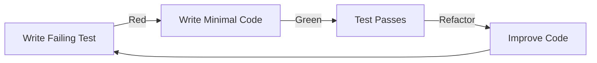

# Activity 04: Build

The execution activity where we transform designs and contracts into working code using test-driven development.

## Purpose

The Build activity is where code comes to life. Following the contracts and test specifications from Design, this activity emphasizes test-driven development (TDD), incremental delivery, and continuous validation. Every line of code is written to make a failing test pass.

## Key Principle

**Red-Green-Refactor**: Write failing tests first (Red), write minimal code to pass (Green), then improve code quality (Refactor). No production code exists without a failing test demanding it.

## Input Gate

Before starting Build activity, verify Test activity outputs:
- [ ] All test suites written and reviewed
- [ ] Tests are failing (Red activity of TDD)
- [ ] Test coverage plan approved
- [ ] CI/CD pipeline configured for tests
- [ ] Test procedures documented
- [ ] Test infrastructure operational
- [ ] Security test suite completed and failing
- [ ] SAST/DAST tools configured in CI/CD pipeline
- [ ] Security coding standards established

## Artifacts

### 1. Implementation Plan
**Location**: `artifacts/implementation-plan/`
**Output**: `docs/helix/04-build/implementation-plan.md`

Technical execution strategy:
- **Build Activities**: Incremental delivery approach
- **Component Order**: What to build first
- **Technology Setup**: Development environment
- **Coding Standards**: Conventions and patterns
- **Integration Points**: How components connect
- **Resource Planning**: Team assignments and timeline
- **Build Issue Strategy**: How story-level execution is decomposed into tracker issues

`secure-coding` remains retired as a standalone HELIX artifact. Its useful
responsibility is already covered by the current build contract:

- `docs/helix/01-frame/security-requirements.md` defines the security obligations
- `docs/helix/01-frame/threat-model.md` and `docs/helix/02-design/security-architecture.md` define the design-level controls
- `docs/helix/03-test/security-tests.md` and build-activity security scans verify the implementation
- project concerns can add stack-specific practices without promoting a generic checklist into the core workflow

Reintroducing `secure-coding` as its own artifact would recreate the same thin,
duplicative checklist that HELIX already retired.

### Story Build Work Items
**Output Location**: the runtime's work-item tracker

Story-level implementation work is tracked as build work items in the runtime
tracker rather than per-story markdown plans. Build work items:
- reference the user story, technical design, test plan, and build plan
- use native tracker issue IDs, dependencies, labels, and ready queues
- define deterministic implementation steps
- close independently once verification criteria are met

The canonical execution flow action for ready work is **build**: it
handles one work item per run — select or load a ready execution item, claim
it, validate governing artifacts, perform the scoped work, run required
verification, create follow-on items when needed, commit with traceability,
close the item, and exit.

Use this action as the canonical ready-queue entry point. Use story- or
feature-specific Build actions only when the work is already explicitly scoped
to that story or feature.

When the ready queue drains, do not switch to an unconditional loop. Run the
cross-activity **check** action instead — it determines whether the next step is
more implementation, alignment, backfill, waiting on blockers, user guidance,
or stopping.

See the runtime integration appendix below for the concrete dispatch commands.

## Core Workflow

### Test-Driven Development Cycle



### Build Order

1. **Contract Tests First**
   - Create test files for all external interfaces
   - Run tests - verify they fail
   - This defines what "done" looks like

2. **Integration Tests Second**
   - Create tests for component interactions
   - Run tests - verify they fail
   - This ensures components work together

3. **Implementation Last**
   - Write minimal code to pass first test
   - Refactor when green
   - Move to next failing test
   - Repeat until all tests pass

## Human vs AI Responsibilities

### Human Responsibilities
- **Code Review**: Ensure quality and maintainability
- **Architectural Integrity**: Maintain design decisions
- **Problem Solving**: Handle unexpected challenges
- **Performance Optimization**: Profile and optimize
- **Security Review**: Validate security practices

### AI Assistant Responsibilities
- **Code Generation**: Write code to pass tests
- **Test Implementation**: Create test files from specifications
- **Refactoring**: Improve code structure
- **Documentation**: Generate inline documentation
- **Pattern Application**: Apply consistent coding patterns

## Build Activities

### Activity 1: Foundation (Red)
**Goal**: All tests written and failing

Deliverables:
- [ ] Contract test files created
- [ ] Integration test files created
- [ ] Test runner configured
- [ ] All tests failing with clear messages
- [ ] CI/CD pipeline running tests

**Success Criteria**:
- 100% of specified tests exist
- 0% of tests passing
- Clear failure messages

### Activity 2: Core Build (Green)
**Goal**: Make tests pass incrementally

Deliverables:
- [ ] Core libraries implemented
- [ ] CLI interface functional
- [ ] Data persistence working
- [ ] Error handling complete
- [ ] All contract tests passing

**Success Criteria**:
- 100% contract tests passing
- 100% integration tests passing
- No implementation without test

### Activity 3: Quality (Refactor)
**Goal**: Improve code without breaking tests

Deliverables:
- [ ] Code refactored for clarity
- [ ] Performance optimized
- [ ] Documentation complete
- [ ] Security hardened
- [ ] Edge cases handled

**Success Criteria**:
- All tests still passing
- Code coverage meets targets
- Performance requirements met
- Security scan passing

## Quality Standards

### Code Quality Checklist
- [ ] **Single Responsibility**: Each function/class has one job
- [ ] **DRY**: No duplicated logic
- [ ] **YAGNI**: No speculative features
- [ ] **Readable**: Code explains itself
- [ ] **Testable**: Easy to test in isolation

### Test Quality Standards
- [ ] **Fast**: Tests run quickly
- [ ] **Independent**: Tests don't depend on each other
- [ ] **Repeatable**: Same result every time
- [ ] **Self-Validating**: Clear pass/fail
- [ ] **Timely**: Written before code

## Common Patterns

### Pattern: Contract Test First
```bash
# 1. Create contract test
test/contracts/cli_test.go

# 2. Run test - see it fail
make test  # FAIL: CLI not found

# 3. Create minimal implementation
cmd/cli.go

# 4. Run test - see it pass
make test  # PASS

# 5. Refactor if needed
# Improve structure while tests stay green
```

### Pattern: Integration Test Flow
```bash
# 1. Create integration test
test/integration/workflow_test.go

# 2. Test fails - components don't exist
make test  # FAIL: Components not found

# 3. Build components incrementally
internal/component1/
internal/component2/

# 4. Connect components
internal/workflow/

# 5. Test passes
make test  # PASS
```

## Build Guidelines

### Do's ✅
- Write the test first, always
- Make tests fail before making them pass
- Write minimal code to pass tests
- Refactor only when tests are green
- Commit after each passing test
- Keep build log for progress tracking

### Don'ts ❌
- Write code without a failing test
- Write multiple features at once
- Skip the refactor step
- Add features not in specifications
- Mock when you can use real dependencies
- Ignore failing tests

## Incremental Delivery

### Daily Progress Tracking
Track progress to maintain momentum:

| Day | Tests Written | Tests Passing | Coverage | Notes |
|-----|--------------|---------------|----------|--------|
| 1 | 10 | 0 | 0% | All contract tests written |
| 2 | 15 | 5 | 30% | CLI interface working |
| 3 | 20 | 15 | 60% | Core library complete |
| 4 | 20 | 20 | 85% | All tests passing |

### Continuous Integration
Every commit should:
1. Pass all existing tests
2. Not break previous functionality
3. Include its own tests
4. Update documentation
5. Pass linting and formatting

## Common Pitfalls

### ❌ Avoid These Mistakes

1. **Writing Code Without Tests**
   - Bad: "I'll add tests later"
   - Good: Test fails → Code written → Test passes

2. **Big Bang Integration**
   - Bad: Build everything then integrate
   - Good: Integrate continuously as you build

3. **Over-Engineering**
   - Bad: Adding features "just in case"
   - Good: Only what tests require

4. **Test After Development**
   - Bad: Code complete, now writing tests
   - Good: No code without failing test

5. **Ignoring Refactor Step**
   - Bad: Moving to next feature immediately
   - Good: Clean up before moving on

## Success Criteria

The Build activity is complete when:

1. **All Tests Pass**: 100% of specified tests green
2. **Coverage Met**: Contract coverage 100%, critical paths covered
3. **Performance Verified**: Meets requirements under load
4. **Security Validated**: Passes security scans
5. **Documentation Complete**: Code and API documented
6. **Code Review Done**: Approved by team

## Next Activity: Deploy

Once Build is complete, proceed to Deploy activity for:
- Production deployment
- Environment configuration
- Release management
- Monitoring setup
- Go-live activities

Remember: Build creates the "what" - Deploy makes it available to users.

## Tools and Commands

### Development Workflow
```bash
# Run tests continuously
make watch-test

# Run specific test
make test TEST=TestContractCLI

# Check coverage
make coverage

# Run linting
make lint

# Format code
make fmt
```

### TDD Rhythm
```bash
# 1. RED: Write failing test
echo "test_cli_accepts_input()" > test_cli.py
pytest  # FAIL

# 2. GREEN: Make it pass
echo "def accept_input(): pass" > cli.py
pytest  # PASS

# 3. REFACTOR: Improve
# Refactor cli.py while keeping tests green
pytest  # STILL PASS
```

## Build Artifacts

By the end of Build activity, you should have:

1. **Source Code**: All production code
2. **Test Suite**: Comprehensive test coverage
3. **Documentation**: API docs, README, comments
4. **Build Scripts**: Compilation and packaging
5. **CI/CD Config**: Automated testing pipeline
6. **Deployment Package**: Ready for deployment

## Tips for Success

1. **Small Steps**: One test, one feature at a time
2. **Frequent Commits**: Commit every passing test
3. **Pair Programming**: Two eyes catch more issues
4. **Continuous Integration**: Test on every push
5. **Refactor Courageously**: Tests are your safety net

## Using AI Assistance

Build execution is driven by the **build** action following the bounded loop
defined in `actions/implementation.md`. Use the activity artifacts under
`activities/04-build/artifacts/` when you need supporting build documentation or
work-item guidance.

Common entry points:
- `artifacts/implementation-plan/`

AI is useful for implementation drafting and focused refactoring. Human review
must verify design fidelity, test intent, and security-sensitive changes.

## Runtime Integration Appendix

Build execution is driven by the runtime: it drains the ready queue and executes
each ready work item end-to-end, or executes a single specified work item. When
the queue drains, `/helix check` decides the next action. HELIX specifies the
action; the runtime supplies the work-item store and the execution loop.

See [../../EXECUTION.md](../../EXECUTION.md) for the full runtime-neutral
execution contract, and the per-runtime install guide for concrete commands
([docs/install/ddx.md](../../../docs/install/ddx.md) for DDx).

---

*"The only way to go fast is to go well." - Robert C. Martin*

*Build activity is where disciplined engineering practices pay off. Trust the process.*
