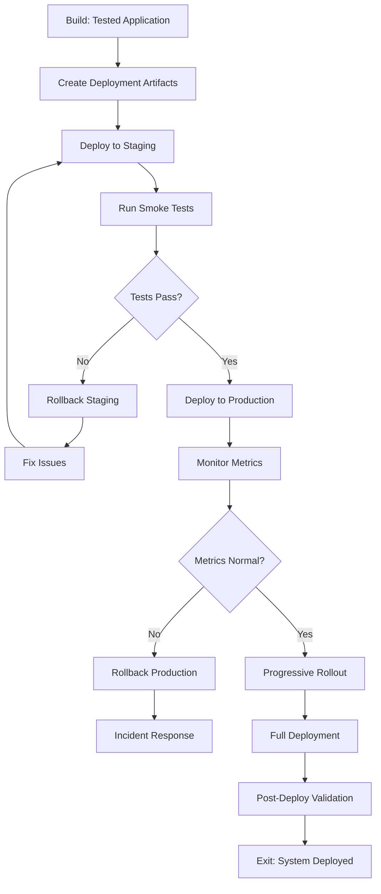

# Activity 05: Deploy

The release activity where tested and validated code is deployed to production with proper monitoring, documentation, and rollback procedures.

## Purpose

The Deploy activity takes the thoroughly tested application from the Build activity and releases it to production environments. This activity emphasizes automation, observability, and reliability, ensuring smooth deployments with minimal downtime and quick recovery options.

## Key Principle

**Deployment is Repeatable**: Every deployment should be automated, monitored, and reversible. The same process that deploys to staging must deploy to production, ensuring consistency and reliability.

## Workflow Principles

This activity operates under the HELIX workflow principles, emphasizing:

- **Automated Deployment**: Infrastructure as code, CI/CD pipelines, zero-downtime deployments
- **Progressive Rollout**: Canary deployments, feature flags, gradual traffic shifting
- **Observability First**: Comprehensive monitoring before, during, and after deployment
- **Human-AI Collaboration**: Humans make go/no-go decisions; AI assists with automation and analysis
- **Iterative Improvement**: Each deployment teaches lessons for the next cycle

Deployment is not just about moving code to production—it's about doing so safely, observably, and repeatably.

## Input Gates

Prerequisites to enter this activity (defined in `input-gates.yml`):

1. **All tests passing**
   - Requirement: Unit, integration, and E2E tests all green
   - Validation: `npm test` or `go test ./...` shows 100% pass rate
   - Source: 04-build activity

2. **Performance validated**
   - Requirement: Performance tests meet defined thresholds
   - Validation: Load test results within SLA requirements
   - Source: 04-build activity

3. **Security scan completed**
   - Requirement: No critical or high vulnerabilities
   - Validation: Security audit passes (`npm audit`, SAST tools)
   - Source: 04-build activity

4. **Documentation updated**
   - Requirement: API docs, README, and changelog current
   - Validation: Documentation review completed
   - Source: 04-build activity

These gates ensure only production-ready code proceeds to deployment.

## Process Flow



## Work Items

### Artifacts

Deploy artifacts are project-specific, but current HELIX still treats four
deploy surfaces as first-class in the live contract:
`deployment-checklist`, `monitoring-setup`, `runbook`, and `release-notes`.

- `deployment-checklist` is the technical go or no-go surface for rollout.
- `monitoring-setup` defines the dashboards, alerts, and health checks that
  prove the rollout is safe.
- `runbook` explains operator response procedures for rollback, recovery, and
  incidents.
- `release-notes` communicate the shipped changes, required actions, and known
  caveats to users or operators.

The deleted `launch-checklist` artifact stays superseded rather than restored.
Its former umbrella scope is now split deliberately across the current deploy
contract: `deployment-checklist` covers technical go/no-go readiness,
`monitoring-setup` covers observability readiness, `runbook` covers operator
response, `release-notes` cover release communication, and linked
`activity:deploy` tracker issues carry coordination, owners, and dependencies.
Restoring a separate launch checklist would collapse distinct responsibilities
back into one vague surface without adding a new prompt or template contract.

The deleted `gtm-plan` artifact stays retired. Its only durable HELIX-native
responsibilities are already covered by the current deploy contract:
`release-notes` handle release-scoped communication, and linked `activity:deploy`
tracker issues carry launch coordination, owners, approvals, and communication
checkpoints. Broader go-to-market or adoption planning is project-specific
business planning rather than a portable HELIX artifact, so restoring
`gtm-plan` would either duplicate `release-notes` or reintroduce another thin,
non-actionable launch stub.

`CHANGELOG.md` may still exist as a repository history log, but it does not
replace release-scoped notes that are audience-filtered and action-oriented.

### Deploy Work Items
**Output Location**: the runtime's work-item tracker

Deploy work is tracked as `activity:deploy` work items in the runtime-provided work-item source
rather than per-story deployment markdown plans. These items cover both
story-scoped rollout execution and release-scoped coordination slices such as
owners, dependencies, approval handoffs, and communication checkpoints. Deploy
work items reference the project deployment artifacts and the build items they
are rolling out using native tracker IDs, dependencies, and labels.

The deleted `story-deployment-plan` artifact stays retired. Its only durable
responsibility is to define scoped rollout work, and the runtime-provided work-item source now
does that more directly through `activity:deploy` work items linked to the
governing deploy artifacts.

## Artifact Metadata

Each artifact can include a `meta.yml` file that defines:
- **Dependencies**: Links to Build artifacts that inform deployment
- **Environment Variables**: Configuration needed for deployment
- **Validation Rules**: Checks for deployment readiness
- **Rollback Triggers**: Conditions that trigger automatic rollback
- **Monitoring Thresholds**: Metrics that indicate health

### Actions (Prompt-Only Operations)

#### 1. Deploy to Staging
**Action Location**: `actions/deploy-to-staging/`

Execute staging deployment:
- Build and package application
- Deploy to staging environment
- Run smoke tests
- Verify monitoring
- Load test if needed

#### 2. Deploy to Production
**Action Location**: `actions/deploy-to-production/`

Execute production deployment:
- Blue-green or canary deployment
- Progressive traffic shifting
- Health check validation
- Metrics monitoring
- Rollback if needed

#### 3. Configure Monitoring
**Action Location**: `actions/configure-monitoring/`

Set up observability:
- Deploy monitoring agents
- Configure dashboards
- Set up alerts
- Test alert channels
- Document escalation

#### 4. Rollback Deployment
**Action Location**: `actions/rollback-deployment/`

Emergency rollback procedures:
- Identify rollback point
- Execute rollback
- Verify system stability
- Document incident
- Post-mortem preparation

#### 5. Smoke Test
**Action Location**: `actions/smoke-test/`

Post-deployment validation:
- Critical path testing
- API endpoint checks
- Database connectivity
- External service integration
- Performance baseline

## Deployment Strategies

### Blue-Green Deployment
- Maintain two identical environments
- Deploy to inactive environment
- Switch traffic after validation
- Keep old environment for quick rollback

### Canary Deployment
- Deploy to small percentage of servers
- Monitor error rates and performance
- Gradually increase traffic
- Full rollout or rollback based on metrics

### Rolling Deployment
- Update servers incrementally
- Maintain service availability
- Monitor each batch
- Pause or rollback on issues

### Feature Flags
- Deploy code with features disabled
- Enable features progressively
- A/B testing capabilities
- Quick feature rollback without deployment

## Human vs AI Responsibilities

### Human Responsibilities
- **Go/No-Go Decisions**: Final deployment approval
- **Risk Assessment**: Evaluate deployment timing and impact
- **Incident Response**: Handle production issues
- **Stakeholder Communication**: Coordinate with teams
- **Business Validation**: Verify features work as intended

### AI Assistant Responsibilities
- **Automation Scripts**: Generate deployment scripts
- **Configuration Management**: Manage environment configs
- **Monitoring Setup**: Configure dashboards and alerts
- **Documentation**: Generate runbooks and procedures
- **Pattern Recognition**: Identify deployment risks

## Quality Gates

Before marking deployment complete:

### Pre-Deployment Checks
- [ ] All tests passing in CI/CD
- [ ] Security scans completed
- [ ] Performance benchmarks met
- [ ] Documentation updated
- [ ] Rollback plan tested

### Deployment Validation
- [ ] Staging deployment successful
- [ ] Smoke tests passing
- [ ] Monitoring active
- [ ] Alerts configured
- [ ] Load tests passing (if required)

### Post-Deployment Verification
- [ ] Production smoke tests passing
- [ ] Key metrics within normal range
- [ ] No critical alerts firing
- [ ] User journeys working
- [ ] Rollback tested and ready

## Common Pitfalls

### ❌ Avoid These Mistakes

1. **Deploying Without Monitoring**
   - Bad: Deploy first, add monitoring later
   - Good: Monitoring ready before deployment

2. **No Rollback Plan**
   - Bad: Figure out rollback when needed
   - Good: Test rollback procedure in staging

3. **Big Bang Deployments**
   - Bad: Deploy everything at once
   - Good: Progressive rollout with monitoring

4. **Manual Deployment Steps**
   - Bad: Follow wiki for deployment
   - Good: Fully automated deployment pipeline

5. **Ignoring Non-Functional Requirements**
   - Bad: Focus only on features
   - Good: Validate performance, security, accessibility

## Exit Criteria

The Deploy activity is complete and Iterate activity can begin when:

1. **Application Deployed**: Code running in production
   - Validation: Health checks passing
2. **Monitoring Active**: All dashboards and alerts configured
   - Validation: Test alert fired and received
3. **Documentation Complete**: Runbooks and procedures updated
   - Validation: Team review completed
4. **Performance Validated**: Meets SLA requirements
   - Validation: Load test results acceptable
5. **Rollback Ready**: Can quickly revert if needed
   - Validation: Rollback tested in staging
6. **Stakeholders Notified**: Release communicated
   - Validation: Release notes published

## Next Activity: Iterate

Once Deploy activity completes, proceed to Iterate where you'll:
- Collect user feedback
- Analyze production metrics
- Identify improvements
- Plan next iteration
- Update documentation

Remember: Deployment is not the end—it's the beginning of learning from real users!

## Infrastructure as Code

### Configuration Management
```yaml
# deployment.yml
environments:
  staging:
    replicas: 2
    resources:
      cpu: 500m
      memory: 512Mi
    autoscaling:
      min: 2
      max: 4

  production:
    replicas: 4
    resources:
      cpu: 1000m
      memory: 1Gi
    autoscaling:
      min: 4
      max: 20
```

### CI/CD Pipeline
```yaml
# .github/workflows/deploy.yml
deploy:
  staging:
    - build
    - test
    - deploy-staging
    - smoke-test
    - approval-gate

  production:
    - deploy-canary (10%)
    - monitor (5m)
    - deploy-canary (50%)
    - monitor (10m)
    - deploy-full
    - smoke-test
```

## Monitoring and Observability

### Key Metrics
- **Availability**: Uptime percentage
- **Latency**: Response time percentiles
- **Traffic**: Requests per second
- **Errors**: Error rate and types
- **Saturation**: Resource utilization

### Alert Priorities
- **P1 (Critical)**: Service down, data loss risk
- **P2 (High)**: Degraded performance, partial outage
- **P3 (Medium)**: Non-critical errors, approaching limits
- **P4 (Low)**: Informational, trends

## Tips for Success

1. **Automate Everything**: Manual steps lead to errors
2. **Monitor Before Deploy**: Observability first
3. **Practice Rollbacks**: Test them regularly
4. **Communicate Clearly**: Keep stakeholders informed
5. **Learn from Incidents**: Blameless post-mortems
6. **Progressive Rollout**: Start small, expand gradually
7. **Feature Flags**: Separate deployment from release

## Using AI Assistance

Deploy execution is driven by deploy work items processed through the **build**
flow action (the runtime's bounded execution surface). Create or update
the deploy artifacts your release needs under `docs/helix/05-deploy/`:
`deployment-checklist`, `monitoring-setup`, `runbook`, and `release-notes`.

AI is useful for rollout documentation, release notes, checklists, and
observability setup. Go/no-go decisions, incident handling, and rollback
approval remain human-owned.

## File Organization

### Structure Overview
- **Deployment Definitions**: `workflows/activities/05-deploy/`
  - Templates and prompts for deployment artifacts
  - Action definitions for deployment tasks

- **Generated Artifacts**: `docs/helix/05-deploy/`
  - `docs/helix/05-deploy/deployment-checklist.md` - Deployment checklist and
    release gating steps
  - `docs/helix/05-deploy/monitoring-setup.md` - Monitoring setup,
    dashboards, and alerts
  - `docs/helix/05-deploy/runbook.md` - Runbooks and operational procedures
  - `docs/helix/05-deploy/release-notes.md` - Release notes, operator actions,
    and known issues

This separation keeps deploy templates reusable while keeping the canonical
release artifacts together in the HELIX docs tree.

## Runtime Integration Appendix

Deploy execution is driven by the runtime: it executes one ready deploy work
item per pass, or drains the ready queue, with `/helix check` deciding next
steps when the queue drains. HELIX specifies the action; the runtime supplies
the work-item store and execution loop. See
[../../EXECUTION.md](../../EXECUTION.md) for the full runtime-neutral execution
contract, and the per-runtime install guide for concrete commands
([docs/install/ddx.md](../../../docs/install/ddx.md) for DDx).

---

*Deployment is where preparation meets production. Do it right, and users never notice. Do it wrong, and everyone knows.*
