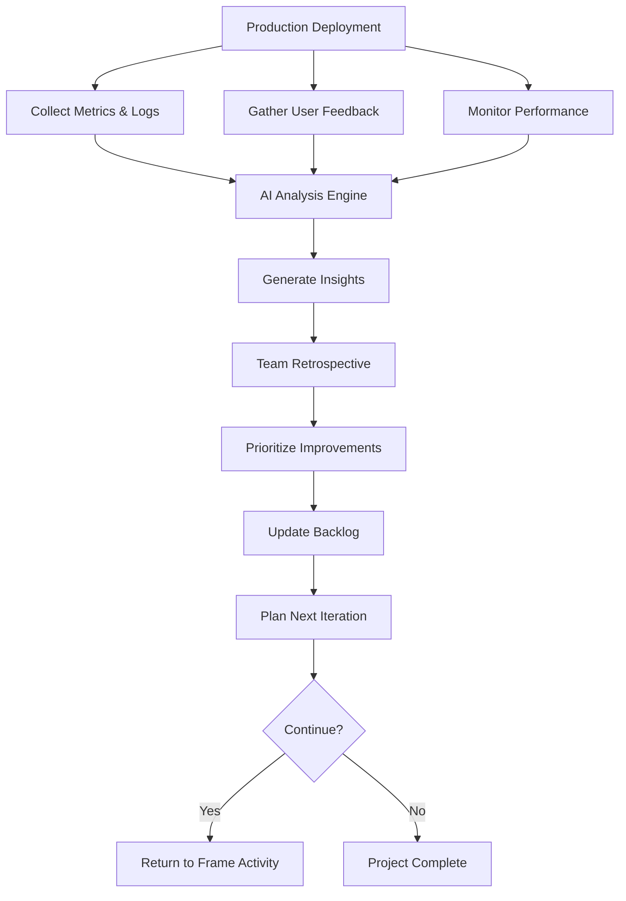

# Activity 06: Iterate

The continuous learning activity where production insights, user feedback, and team experiences transform into actionable improvements for the next cycle.

## Purpose

The Iterate activity closes the HELIX loop by systematically capturing learnings from production deployment and user interaction. This activity emphasizes data-driven decision making, AI-assisted pattern recognition, and continuous improvement. Every iteration makes the next cycle more efficient, higher quality, and better aligned with user needs.

## Key Principle

**Learn, Adapt, Evolve**: Every deployment teaches valuable lessons. Through AI-powered analysis of metrics, feedback, and experiences, we identify patterns, predict issues, and continuously improve both the product and the process.

## Workflow Principles

This activity embodies the HELIX workflow's commitment to:

- **Continuous Learning**: Every data point contributes to organizational knowledge
- **AI-Powered Insights**: Machine learning identifies patterns humans might miss
- **Predictive Improvement**: Anticipate issues before they become problems
- **Human-AI Synthesis**: Combine human intuition with AI analysis
- **Feedback Loop Closure**: Learnings directly influence the next Frame activity

The Iterate activity transforms HELIX from a linear process into a true spiral of continuous improvement.

## Input Gates

Prerequisites to enter this activity (defined in `input-gates.yml`):

1. **System deployed to production**
   - Requirement: Application running in production environment
   - Validation: Health checks passing, monitoring active
   - Source: 05-deploy activity

2. **Monitoring and observability active**
   - Requirement: Metrics, logs, and traces being collected
   - Validation: Dashboards populated with real data
   - Source: 05-deploy activity

3. **Initial user interaction**
   - Requirement: Sufficient usage to generate meaningful data
   - Validation: Minimum threshold of user actions/time passed
   - Source: Production environment

4. **Team availability for retrospective**
   - Requirement: Core team members available for review
   - Validation: Retrospective scheduled and confirmed
   - Source: Team calendar

These gates ensure meaningful data exists for analysis and learning extraction.

## Process Flow

## Metric Four-Way Slice

Four iterate artifacts form one slice of the metric loop. Each owns a distinct
job; together they carry an iteration from "what we measure" to "what we do
next":

- **Metric Definition** is the contract. It fixes the name, unit, direction,
  command, and tolerance for one measurement. Every other artifact in the
  slice cites a metric definition rather than redefining one.
- **Metrics Dashboard** is the current-values view. It consumes metric
  definitions, compares current readings against baseline or ratchet floor,
  and produces an iteration-level decision (improved, regressed, noise).
- **Security Metrics** is the security slice of the dashboard. It uses the
  same definition contract but scopes the view to incident response,
  vulnerability management, application security, and compliance signals.
- **Improvement Backlog** consumes dashboard signal (including the security
  slice) and turns it into prioritized follow-up work with an explicit
  next-iteration selection.

Flow: definitions feed dashboards; the security dashboard is the
security-shaped slice of the same data; backlog consumes dashboard signal.
Each artifact prompt cross-references this section instead of restating the
relationship.

## Work Items

### Artifacts

#### Metric Definition
**Artifact Location**: `artifacts/metric-definition/`
**Output Location**: `docs/helix/06-iterate/metrics/*.yaml`

Individual metric specification: name, unit, direction (higher-is-better or
lower-is-better), measurement command, tolerance band, and ratchet floor.

#### Metrics Dashboard
**Artifact Location**: `artifacts/metrics-dashboard/`
**Output Location**: `docs/helix/06-iterate/metrics-dashboard.md`

Iteration-level summary artifact:
- compares the current measurement set against a baseline or ratchet floor
- synthesizes product, operator, and stakeholder signals into one decision view
- states whether the latest changes improved, regressed, or stayed within noise
- links the conclusions to follow-up tracker work when action is required

#### Security Metrics and Analysis
**Artifact Location**: `artifacts/security-metrics/`
**Output Location**: `docs/helix/06-iterate/security-metrics.md`

Security posture monitoring and improvement tracking:
- **Security incident response metrics (MTTD, MTTR)**
- **Vulnerability management and remediation tracking**
- **Compliance monitoring and audit findings analysis**
- **Security training effectiveness and awareness metrics**
- **Threat landscape analysis and defense effectiveness**
- **Security improvement backlog prioritization and planning**

**AI Capabilities**:
- Security trend analysis and pattern recognition
- Threat correlation and risk assessment
- Automated compliance monitoring and reporting
- Security control effectiveness measurement

#### Improvement Backlog
**Artifact Location**: `artifacts/improvement-backlog/`
**Output Location**: `docs/helix/06-iterate/improvement-backlog.md`

Prioritized iteration follow-up surface:
- turns metrics, feedback, incidents, and retrospectives into ranked work
- links each candidate to supporting evidence and tracker issues
- makes the next iteration candidate explicit instead of leaving loose notes

`lessons-learned` remains retired as a standalone HELIX artifact. Its durable
responsibility is already covered by the current iterate contract:

- `metrics-dashboard` records the iteration-level summary and non-security
  learnings that changed the decision view
- `security-metrics` records the security-specific lessons when incidents,
  vulnerabilities, or compliance findings changed what the cycle taught
- `improvement-backlog` turns those learnings into prioritized tracker-backed
  follow-up work and an explicit next-cycle selection
- upstream canonical docs absorb the durable behavioral change: update the PRD,
  feature specs, stories, risk registers, or tests when the learning changes
  future expectations

Reintroducing `lessons-learned` would duplicate the same evidence across a thin
summary doc plus the artifacts and governing updates that already need to carry
the real decision.

`feedback-analysis` remains retired as a standalone HELIX artifact. Its useful
responsibility is already covered by the current iterate contract:

- `metrics-dashboard` synthesizes cross-signal learnings into an iteration-level decision
- `security-metrics` captures the security-specific slice when feedback is about risk or incidents
- `improvement-backlog` turns those learnings into prioritized follow-up work

Tracker issues remain the executable follow-on system. Reintroducing
`feedback-analysis` would split one evidence trail across another thin document.

`story-iteration-report` remains retired as a standalone HELIX artifact. Its
old story-scoped intent is already covered by the current iterate contract:

- deploy issues and their execution evidence record what one bounded slice
  shipped, what happened during rollout, and what changed relative to plan
- `metrics-dashboard` records iteration-level outcome summaries when that slice
  materially changes the measured system state
- `security-metrics` records the security-specific result when the slice affects
  incidents, vulnerabilities, compliance, or operational risk
- `improvement-backlog` and tracker issues capture the prioritized follow-on
  work instead of leaving it in a prose-only report
- upstream canonical docs absorb the durable behavioral change: update the PRD,
  feature specs, stories, risk registers, or tests when the learning changes
  future expectations

For story-state detection, the deterministic ITERATE threshold remains
completion of all matching `activity:deploy` issue(s) with no matching deploy
issue remaining not closed. If any matching deploy issue is not closed,
including `status: in_progress`, the story remains in DEPLOY. Shared iterate
outputs provide iteration-wide context, and linked tracker follow-on work adds
story-specific evidence when present; HELIX does not require a story-keyed
iterate document.

The deleted prompt and template were too thin to justify restoring a separate
canonical report. Reintroducing `story-iteration-report` would duplicate
evidence already owned by execution issues, iterate summary artifacts, and the
tracker-backed follow-on system.

#### Cross-Activity Action: Alignment Review
**Action Location**: `../../actions/reconcile-alignment.md`
**Output Location**: `docs/helix/06-iterate/alignment-reviews/AR-YYYY-MM-DD[-scope].md`

Cross-activity reconciliation review:
- creates or reconciles a review epic and review issues in the tracker
- audits the canonical HELIX stack against implementation evidence
- writes a consolidated alignment report for the review run
- emits follow-up execution issues only where explicit gaps exist

#### Cross-Activity Action: Queue Check
**Action Location**: `../../actions/check.md`
**Output Location**: terminal response only

Bounded execution-state review:
- inspects ready, in-progress, and blocked HELIX work
- checks whether the current scope should implement, align, backfill, wait, ask for guidance, or stop
- returns a deterministic `NEXT_ACTION` code and the exact next command
- should be used when the implementation queue drains instead of looping blindly

#### Cross-Activity Action: Documentation Backfill
**Action Location**: `../../actions/backfill-helix-docs.md`
**Output Location**: `docs/helix/06-iterate/backfill-reports/BF-YYYY-MM-DD[-scope].md`

Research-first documentation reconstruction:
- inventories existing docs, code, tests, CI, and operational evidence
- reconstructs missing HELIX artifacts conservatively from current state
- asks for user guidance before low-confidence canonical content is finalized
- writes a durable backfill report with assumptions, confidence, and follow-up work

## Artifact Metadata

Each artifact directory includes a `meta.yml` file that defines:
- **Data Sources**: Metrics, logs, feedback channels
- **Analysis Frequency**: Real-time, daily, weekly, per-iteration
- **AI Models Used**: Specific ML models for analysis
- **Automation Level**: Full, semi, or manual processing
- **Integration Points**: How insights feed back into workflow

## Human vs AI Responsibilities

### Human Responsibilities
- **Strategic Decisions**: Determine product direction
- **Stakeholder Communication**: Manage expectations and relationships
- **Creative Problem Solving**: Innovate solutions to complex issues
- **Team Morale**: Maintain team health and motivation
- **Final Prioritization**: Make trade-off decisions

### AI Assistant Responsibilities
- **Data Analysis**: Process large volumes of metrics and logs
- **Pattern Recognition**: Identify trends and correlations
- **Anomaly Detection**: Alert on unusual patterns
- **Prediction**: Forecast future issues and opportunities
- **Report Generation**: Synthesize insights into actionable reports
- **Recommendation Engine**: Suggest improvements based on data

## Quality Gates

Before proceeding to the next Frame activity, ensure:

### Analysis Completeness
- [ ] All production metrics analyzed
- [ ] User feedback synthesized
- [ ] Performance baselines established
- [ ] Incidents reviewed and documented
- [ ] Team retrospective completed

### Learning Extraction
- [ ] Patterns identified across data sources
- [ ] Durable learnings threaded into canonical iterate outputs and upstream artifacts
- [ ] Success factors understood
- [ ] Failure modes analyzed
- [ ] Knowledge base updated

### Planning Readiness
- [ ] Improvement backlog prioritized
- [ ] Next iteration goals defined
- [ ] Resource allocation planned
- [ ] Risk mitigation strategies identified
- [ ] Success metrics established

## Common Pitfalls

### ❌ Avoid These Mistakes

1. **Analysis Paralysis**
   - Bad: Endless analysis without action
   - Good: Time-boxed analysis with clear decisions

2. **Ignoring Negative Feedback**
   - Bad: Cherry-picking positive metrics
   - Good: Honest assessment of all feedback

3. **Skipping Retrospectives**
   - Bad: Moving to next iteration without reflection
   - Good: Dedicated time for team learning

4. **Over-Reacting to Anomalies**
   - Bad: Major pivots based on outliers
   - Good: Statistical significance before changes

5. **Knowledge Silos**
   - Bad: Learnings stay with individuals
   - Good: Documented, shared knowledge base

## Success Criteria

The Iterate activity is complete when:

1. **Data Analyzed**: All metrics, logs, and feedback processed
2. **Insights Generated**: Clear learnings extracted from data
3. **Improvements Identified**: Prioritized backlog of enhancements
4. **Team Aligned**: Retrospective completed with follow-up issues identified
5. **Next Cycle Planned**: Clear goals for next iteration
6. **Knowledge Captured**: Learnings documented for future reference

## Continuous Improvement Metrics

Track these metrics across iterations to measure improvement:

### Product Metrics
- **User Satisfaction**: NPS, CSAT trends
- **Performance**: Response time improvements
- **Quality**: Defect rates, incident frequency
- **Adoption**: User growth, feature usage

### Process Metrics
- **Velocity**: Story points per iteration
- **Cycle Time**: Frame to Deploy duration
- **Defect Escape Rate**: Bugs found in production
- **Automation Coverage**: % of automated tests/deployments

### Team Metrics
- **Team Health**: Satisfaction and engagement
- **Knowledge Sharing**: Documentation quality
- **Skill Development**: New capabilities acquired
- **Collaboration**: Cross-functional effectiveness

## Analysis Tools

Iterate work is driven by the cross-activity flow actions (**align**,
**review**, **experiment**) and metric definitions in
`artifacts/metric-definition/`. See the runtime integration appendix below
for the concrete dispatch commands.

## Integration with Next Cycle

The Iterate activity outputs directly influence the next Frame activity:

### Feedback → Requirements
- User feedback becomes new user stories
- Performance issues become NFRs
- Feature requests become product requirements

### Learnings → Design
- Technical lessons inform architecture decisions
- Performance insights guide optimization
- Security findings strengthen design

### Metrics → Success Criteria
- Current baselines become future targets
- Trend analysis sets realistic goals
- Cost data influences scope decisions

## Tips for Success

1. **Automate Data Collection**: Set up comprehensive monitoring before deployment
2. **Regular Analysis Cadence**: Don't wait until iteration end to analyze
3. **Cross-Functional Participation**: Include all roles in retrospectives
4. **Action-Oriented Insights**: Every learning should have an action
5. **Celebrate Successes**: Recognize what worked well
6. **Fail Fast, Learn Faster**: Treat failures as learning opportunities
7. **Document Everything**: Future you will thank current you

## Using AI Assistance

Iterate work is decided through the **check** flow action and the
canonical cross-activity action prompts:
- `actions/reconcile-alignment.md`
- `actions/backfill-helix-docs.md`

For metric tracking, use `artifacts/metric-definition/`.

AI is useful for synthesis, clustering feedback, and surfacing patterns. Human
judgment remains responsible for prioritization, tradeoffs, and scheduling.

## File Organization

### Structure Overview
- **Analysis Artifacts**: `activities/06-iterate/artifacts/` in the HELIX
  content package
  - Templates for capturing and analyzing learnings
  - Prompts for AI-assisted insight generation

- **Generated Insights**: `docs/helix/06-iterate/`
  - Completed analyses and reports
  - Canonical iterate outputs and linked governing updates
  - Prioritized backlog with explicit next-cycle selection

This separation keeps analysis templates reusable while organizing insights where they're most valuable for the team.

## DDx Integration Appendix

Under the DDx reference runtime, iterate work is dispatched through:

- `/helix check` — decide the next iterate action
- `/helix align <scope>` — top-down reconciliation
- `/helix review [scope]` — fresh-eyes post-implementation review
- `/helix experiment [scope]` — metric-driven optimization iteration
- `/helix backfill <scope>` — reconstruct missing canonical docs

See [../../EXECUTION.md](../../EXECUTION.md) for the full DDx execution
contract.

---

*The Iterate activity transforms each ending into a new beginning, ensuring every cycle builds on the learnings of the last. This is where the HELIX spiral ascends.*
