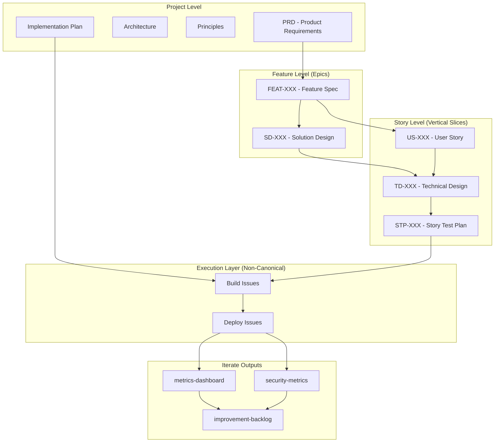

---
ddx:
  id: helix.workflow.artifact-hierarchy
  depends_on:
    - helix.workflow
  review:
    self_hash: dc0881cdb1498e25bf976cd29b4c6d74981a8345ff8178d7f8a34be44e1216c8
    deps:
      ADR-001: 7378dcbdafe49a66a57caba05271b1697f977dd4a9904e299ade220c092c62b3
      helix.prd: 2b22383538b33c6ecee57f43d85128dfef7d56254766b757aa36439e35f2bfc9
      helix.workflow: 1b6caaf3ebc6950bc4fff314e09bc0ee1b71deaa9223a4a70a13f399291ad98c
    reviewed_at: "2026-05-26T03:19:52Z"
---
# HELIX Artifact Hierarchy and Naming Conventions

*Understanding how artifacts flow through the HELIX workflow*

## Overview

The HELIX workflow uses a consistent artifact naming system that enables:
- **Traceability**: Track artifacts from requirements to deployment
- **Vertical Slicing**: Implement stories independently
- **Parallel Development**: Multiple stories in different activities
- **Clear Organization**: Predictable file locations

The workflow also supports a project-level **Parking Lot** registry at
`docs/helix/parking-lot.md` for deferred and future work. Any artifact can be
marked with `ddx.parking_lot: true` to keep it out of dependency graphs and
the main PRD flow while remaining in its normal directory.

## Scope Boundary

This document explains the artifact authority hierarchy, artifact
relationships, naming, and traceability. It does not define ready-queue logic, loop control, or how to
select execution work.

For execution behavior, follow the bounded action prompts under `actions/`.
For runtime-specific tracker, queue, and execution-loop semantics, see the
runtime integration appendix (the DDx reference integration lives in
[DDX.md](DDX.md) and [EXECUTION.md](EXECUTION.md)).

## Canonical Authority Hierarchy

Artifact flow and artifact authority are related but not identical. When two
HELIX artifacts disagree, this is the canonical authority hierarchy:

1. **Product Vision**
2. **PRD**
3. **Feature Specifications and User Stories**
4. **Architecture and ADRs**
5. **Solution Designs and Technical Designs**
6. **Test Plans and Executable Tests**
7. **Implementation Plans**
8. **Source Code and Build Artifacts**

### Notes

- Feature specifications and user stories refine the PRD and remain above downstream design and implementation artifacts.
- Tests govern Build activity execution because they are executable specifications, but they are still derived from Frame and Design artifacts.
- Source code must conform to higher-order artifacts; it does not redefine them.
- Issues are not part of the canonical authority hierarchy. They are
  execution records derived from authoritative artifacts.

## Artifact Types and Relationships

### Canonical Artifacts Plus Execution Issues



## Story-Level Progression and Execution

Each user story progresses through all activities independently:

### Naming Pattern
Canonical story document artifacts use `{Prefix}-{Number}-{descriptive-name}.md`.
Build and deploy execution use native tracker issue IDs. A story enters
ITERATE when all matching `activity:deploy` issues are complete and no matching
deploy issue remains not closed. Shared iterate outputs stay project- or
iteration-level context, while tracker-backed follow-on work adds
story-specific evidence when needed.

### Activity Progression
```
Frame:   US-036-list-mcp-servers.md
Design:  TD-036-list-mcp-servers.md
Test:    STP-036-list-mcp-servers.md
Build:   runtime work item labeled `helix`, `activity:build`, `story:US-036`
Deploy:  runtime work item labeled `helix`, `activity:deploy`, `story:US-036`
Iterate: all `activity:deploy` work items for `story:US-036` are complete and no
         matching deploy item remains not closed; optional tracker follow-on
         work may remain linked to US-036
Context: `metrics-dashboard.md`, `security-metrics.md` (when relevant), and
         `improvement-backlog.md` provide shared iteration-wide context
```

### Artifact Descriptions

| Surface | Artifact Type | Activity | Purpose |
|--------|--------------|-------|---------|
| US | User Story | Frame | Defines WHAT needs to be built |
| TD | Technical Design | Design | Details HOW to build it |
| STP | Story Test Plan | Test | Specifies tests to verify it |
| ISSUE | Build / Deploy Work Item | Build / Deploy | Tracks scoped execution work in the runtime's work-item tracker |
| Iterate outputs | `metrics-dashboard`, `security-metrics`, `improvement-backlog`, plus tracker follow-on work | Iterate | Shared iteration context and prioritized next work after story-level ITERATE is established by completed deploy issue(s), without a separate numbered story report |

## Feature-Level Progression (Epics)

Features represent collections of related stories:

### Naming Pattern
```
Frame:   FEAT-001-mcp-server-management.md
Design:  SD-001-mcp-management.md
```

### Relationships
- One feature (FEAT) contains multiple user stories (US)
- One solution design (SD) guides multiple technical designs (TD)

## Directory Structure

All HELIX artifacts are under `docs/helix/` to support multiple workflows:

```
docs/
└── helix/                              # HELIX workflow artifacts
    ├── 00-discover/
    │   ├── product-vision.md          # Optional project-level discovery
    │   ├── business-case.md
    │   ├── competitive-analysis.md
    │   └── opportunity-canvas.md
    ├── 01-frame/
    │   ├── prd.md                     # Project-level
    │   ├── principles.md               # Project-level
    │   ├── features/
    │   │   └── FEAT-XXX-*.md          # Feature-level
    │   └── user-stories/
    │       └── US-XXX-*.md            # Story-level
    ├── 02-design/
    │   ├── architecture.md            # Project-level
    │   ├── solution-designs/
    │   │   └── SD-XXX-*.md           # Feature-level
    │   └── technical-designs/
    │       └── TD-XXX-*.md           # Story-level
    ├── 03-test/
    │   ├── test-plan.md               # Project-level
    │   └── test-plans/
    │       └── STP-XXX-*.md          # Story-level
    ├── 04-build/
    │   ├── implementation-plan.md     # Project-level
    ├── 05-deploy/
    │   ├── deployment-checklist.md    # Project-level
    │   ├── monitoring-setup.md        # Project-level
    │   ├── runbook.md                 # Project-level
    │   └── release-notes.md           # Project-level
    └── 06-iterate/
        ├── metrics-dashboard.md       # Project-level
        ├── security-metrics.md        # Project-level
        ├── improvement-backlog.md     # Project-level
        ├── alignment-reviews/
        │   └── AR-YYYY-MM-DD-*.md    # Cross-activity reconciliation reports
        └── backfill-reports/
            └── BF-YYYY-MM-DD-*.md    # Research-first backfill reports
```

Runtimes may add a sibling workspace directory for work-item storage and
execution evidence. See the runtime integration appendix for the layout your
runtime uses.

## Cross-References

Each artifact references its dependencies:

### Story-Level References
```markdown
# TD-036-list-mcp-servers.md
**User Story**: [[US-036-list-mcp-servers]]
**Parent Feature**: [[FEAT-001-mcp-server-management]]
**Solution Design**: [[SD-001-mcp-management]]
```

### Feature-Level References
```markdown
# SD-001-helix-supervisory-control.md
**Feature**: [[FEAT-001-helix-supervisory-control]]
**PRD**: [[helix.prd]]
**ADR**: [[ADR-001]]
```

### Traceability Chain
```
FEAT-001 → SD-001 → US-036 → TD-036 → STP-036 → build issue(s) → deploy issue(s) → all deploy issue(s) complete with no matching deploy issue remaining not closed + optional follow-on tracker work (ITERATE evidence)
         ↓
         US-037 → TD-037 → STP-037 → build issue(s) → deploy issue(s) → all deploy issue(s) complete with no matching deploy issue remaining not closed + optional follow-on tracker work (ITERATE evidence)
         ↓
         US-038 → TD-038 → STP-038 → build issue(s) → deploy issue(s) → all deploy issue(s) complete with no matching deploy issue remaining not closed + optional follow-on tracker work (ITERATE evidence)
```

## Naming Rules

### Consistency Rules
1. **Number stays constant**: 036 throughout all activities
2. **Name stays constant**: "list-mcp-servers" throughout
3. **Only canonical story document prefixes change**: US → TD → STP
4. **Build, Deploy, and Iterate use tracker issues and activity docs**: execution is tracked in the built-in tracker, and iterate outcomes land in canonical iterate outputs rather than a numbered HELIX story file

### Valid Examples
✅ `US-001-initialize-ddx.md`
✅ `TD-001-initialize-ddx.md`
✅ `FEAT-014-obsidian-integration.md`

### Invalid Examples
❌ `US-1-init.md` (number must be 3 digits)
❌ `td-001-initialize.md` (prefix must be uppercase)
❌ `US-001-init-ddx.md` (name changed between artifacts)

## State Detection

The workflow state is determined by which artifacts exist:

### Story State Detection
```yaml
If exists US-036: Story is in FRAME
If exists TD-036: Story is in DESIGN
If exists STP-036: Story is in TEST
If open HELIX build work items exist for story US-036: Story is in BUILD
If any HELIX deploy work item for story US-036 is not closed, including status: in_progress: Story is in DEPLOY
If all deploy work items for story US-036 are complete and no matching deploy item remains not closed: Story is in ITERATE
Linked tracker follow-on work adds iterate evidence when present; shared
iterate outputs provide iteration context but are not queried by story ID
```

### Feature State Detection
```yaml
If all stories have US: Feature is in FRAME
If all stories have TD: Feature is in DESIGN
If all stories have tests passing: Feature is in BUILD
```

## Benefits

### 1. Vertical Slicing
Each story can be deployed independently:
- US-036 could be in production (ITERATE)
- US-037 could be in testing (TEST)
- US-038 could be in design (DESIGN)

### 2. Clear Traceability
Follow any requirement through its lifecycle:
```bash
grep -r "US-001" docs/helix/  # Find all artifacts for story 001
```

### 3. Parallel Development
Multiple team members can work on different stories:
- Developer A: Implementing US-036 (BUILD)
- Developer B: Designing US-037 (DESIGN)
- Developer C: Writing tests for US-038 (TEST)

### 4. No State File Needed
State is derived from artifacts:
- No separate HELIX-managed state file
- Git history shows state changes
- Self-healing (state always reflects reality)

## Migration Path

For existing projects:

### Option 1: New Stories Only
- Keep existing artifacts as-is
- Use new naming for new stories
- Both systems coexist

### Option 2: Gradual Migration
- Rename artifacts as they're updated
- Start with active stories
- Complete over time

### Option 3: Full Migration
- Batch rename all artifacts
- Update all references
- Clean cutover

## Examples

### Example 1: MCP Server Management Feature

```
Feature Level:
  FEAT-001-mcp-server-management.md
  SD-001-mcp-management.md

Story Level:
  US-036-list-mcp-servers.md → ... → deploy issue(s) → all deploy issue(s) complete with no matching deploy issue remaining not closed + optional follow-on tracker work
  US-037-install-mcp-server.md → ... → deploy issue(s) → all deploy issue(s) complete with no matching deploy issue remaining not closed + optional follow-on tracker work
  US-038-configure-mcp-server.md → ... → deploy issue(s) → all deploy issue(s) complete with no matching deploy issue remaining not closed + optional follow-on tracker work
```

### Example 2: Story in Multiple Activities

```
Monday:   Create US-041-user-authentication.md (FRAME)
Tuesday:  Create TD-041-user-authentication.md (DESIGN)
Wednesday: Create STP-041-user-authentication.md (TEST)
Thursday: Create build issue(s) for US-041 (BUILD)
Friday:   Create deploy issue(s) for US-041 (DEPLOY)
Next Week: Complete all deploy issue(s) and leave no matching deploy issue not closed; story enters ITERATE and any follow-on work is captured in tracker-backed iteration evidence
```

## Operating This Hierarchy

The methodology actions that operate on this hierarchy are:

- `build` — execute one ready work item against its governing artifacts
- `check` — decide the next action when the ready queue drains
- `align` — reconcile artifacts top-down when authority and evidence diverge
- `backfill` — reconstruct missing canonical artifacts from current evidence

The runtime supplies the queue inspection, execution loop, and dispatch
commands that invoke these actions. See the runtime integration appendix for
concrete command names.

## Runtime Integration

The runtime supplies the concrete queue controls that inspect, execute, and
drain ready work for this hierarchy. For DDx-specific queue commands, see
[docs/install/ddx.md](../docs/install/ddx.md). See [EXECUTION.md](EXECUTION.md)
for the runtime-neutral execution contract.

---

*This hierarchy enables true agile development with independently deployable story slices while maintaining full traceability.*
